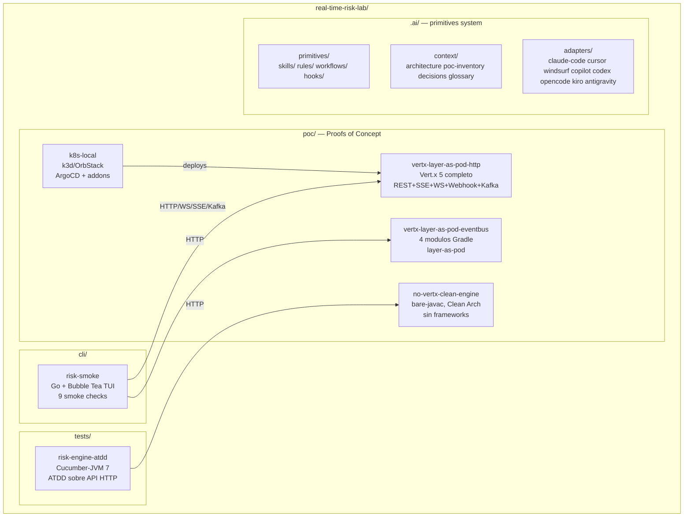

# Architecture — context pointer

> Este archivo es un pointer para agentes. La fuente de verdad atómica vive en `vault/`.

## Mapa rápido

- **Layout enterprise (R2)**: `vault/04-Concepts/Clean-Architecture.md` + `vault/04-Concepts/Hexagonal-Architecture.md`
- **Boundaries (R5)**: `.ai/primitives/rules/clean-arch-boundaries.md`
- **Decisiones cerradas**: `vault/02-Decisions/` (ADRs, ver `_index.md`)
- **MOC raíz**: `vault/00-MOCs/Risk-Platform-Overview.md`
- **PoCs (tabla canónica)**: `AGENTS.md §3` o `docs/03-poc-roadmap.md`
- **Performance + paridad**: `vault/03-PoCs/Poc-Parity-Matrix.md`
- **Observabilidad**: `vault/02-Decisions/0045-observability-stack-local.md`

## Diagrama de alto nivel



## Flujo de una transacción

```
Cliente
  → POST /risk (REST)
    → correlationId generado
    → RiskHandler (infrastructure/controller)
      → EvaluateTransactionUseCase (application/usecase)
        → RuleEngine.evaluate() (domain/rule)
          → Reglas deterministicas (velocidad, monto, comercio)
          → ML scoring (circuit breaker, fallback)
        → TransactionRepository.save() (infrastructure/repository → Postgres)
        → IdempotencyStore.put() (infrastructure/repository → Valkey)
        → EventPublisher.publish() (infrastructure/publisher → Tansu)
    → RiskDecision response + X-Correlation-Id header
  → OTEL span cerrado
  → Log estructurado con correlationId, traceId
```

## Reglas non-negotiable (R1-R5)

Definidas en `AGENTS.md §4` y `.ai/primitives/rules/`.
