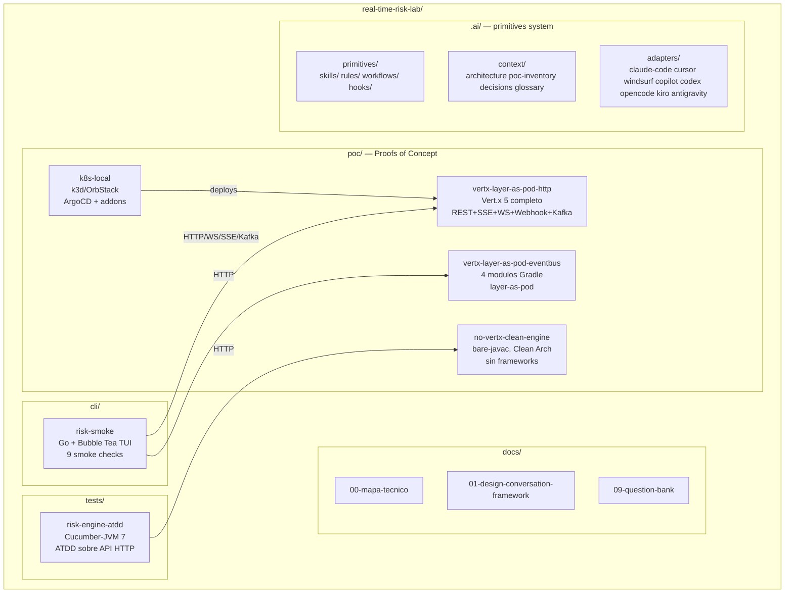

# Arquitectura del repo — real-time-risk-lab

## Diagrama general



## PoC: no-vertx-clean-engine

**Proposito**: demostrar Clean Architecture pura sin frameworks.

```
poc/no-vertx-clean-engine/
├── src/main/java/io/riskplatform/<package>/risk/
│   ├── domain/{entity,repository,usecase,service,rule}
│   ├── application/{usecase,mapper,dto,common}
│   ├── infrastructure/{controller,consumer,repository,resilience,time}
│   ├── config/
│   └── cmd/
└── scripts/{run.sh,test.sh,bench.sh}
```

**Patrones demostrados**: Circuit Breaker, Idempotencia, Outbox, Correlation ID, Virtual Threads, ATDD.

**Como correr**: `./scripts/run.sh` (bare javac, sin Gradle).

## PoC: vertx-layer-as-pod-eventbus

**Proposito**: demostrar arquitectura distribuida con cada capa como pod separado.

```
poc/vertx-layer-as-pod-eventbus/
├── shared/          # DTOs y contratos compartidos
├── controller-app/  # HTTP layer (Vert.x Router)
├── usecase-app/     # Business logic (Vert.x EventBus)
├── repository-app/  # Persistence (Postgres + Valkey)
├── consumer-app/    # Kafka consumer (Tansu)
└── atdd-tests/      # Karate ATDD
```

**Redes Docker**: cada modulo en su propia red Docker con UID distinto.
**Cluster manager**: Hazelcast TCP.

## PoC: vertx-layer-as-pod-http

**Proposito**: plataforma Vert.x 5 completa con todos los patrones de comunicacion.

**Patrones**: REST, SSE, WebSocket, Webhooks, Kafka, OpenAPI, AsyncAPI, OTEL.

## PoC: k8s-local

**Proposito**: replica local de infra produccion para demos k8s.

```
poc/k8s-local/
├── addons/          # Helm values para cada addon
├── argocd/          # AppProject + Application CRDs
├── apps/            # Chart del risk-engine
└── scripts/{up.sh,down.sh,status.sh,demo.sh}
```

**Addons instalados**:
- ArgoCD 9.2.4
- Argo Rollouts 2.40.5
- kube-prometheus-stack 80.11.0
- External Secrets 1.2.1
- Tansu (ADR-0043)
- OpenObserve
- AWS mocks (Moto, MinIO, ElasticMQ, OpenBao)

## Flujo de una transaccion

```
Cliente
  → POST /risk (REST)
    → correlationId generado
    → RiskHandler (infrastructure/controller)
      → EvaluateTransactionUseCase (application/usecase)
        → RuleEngine.evaluate() (domain/rule)
          → Reglas deterministicas (velocidad, monto, comercio)
          → ML scoring (circuit breaker, fallback)
        → TransactionRepository.save() (infrastructure/repository → Postgres)
        → IdempotencyStore.put() (infrastructure/repository → Valkey)
        → EventPublisher.publish() (infrastructure/publisher → Tansu)
    → RiskDecision response + X-Correlation-Id header
  → OTEL span cerrado
  → Log estructurado con correlationId, traceId
```

## Dependencias entre PoCs

- `no-vertx-clean-engine`: independiente. Cero dependencias externas en runtime.
- `vertx-layer-as-pod-eventbus`: requiere docker-compose (Postgres, Valkey, Tansu, OTEL collector).
- `vertx-layer-as-pod-http`: requiere docker-compose similar.
- `k8s-local`: requiere Docker + k3d o OrbStack.
- `tests/risk-engine-atdd`: requiere la app corriendo en `localhost:8080`.
- `cli/risk-smoke`: requiere la app corriendo en `localhost:8080` (o URL configurable).
