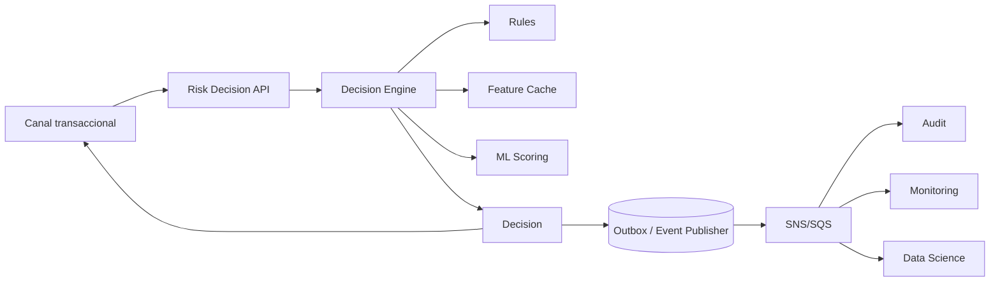

# 00 — Mapa técnico de la propuesta

## 1. Dominio: fraude transaccional en tiempo real

El equipo toma decisiones online sobre transacciones. Una decisión típica puede ser:

- `APPROVE`: aprobar.
- `DECLINE`: rechazar.
- `REVIEW`: enviar a revisión o desafío adicional.

La dificultad no está solo en el TPS. Está en decidir rápido, de forma trazable y explicable, con dependencias externas que pueden fallar.

## 2. SLA real: 150 TPS y ~300ms

150 TPS es manejable, pero exige disciplina si cada request toca reglas, features, modelos ML, bases, caches y eventos.

Key aspects to understand:

- No hablar solo de promedio.
- Preguntar si `300ms` es `p95`, `p99` o promedio.
- Medir latencia end-to-end, no solo el motor interno.
- Definir un budget por dependencia.

Ejemplo de budget:

| Paso | Budget |
|---|---:|
| API / auth / parsing | 20ms |
| Features cacheadas | 20ms |
| Reglas determinísticas | 30ms |
| Modelo ML online | 80ms |
| Persistencia/audit mínimo | 30ms |
| Margen / red / cola / GC | 120ms |

Frase útil:

> Primero defino qué entra en el budget de 300ms y qué saco del camino crítico.

## 3. Camino crítico vs asincrónico

### Camino crítico

Solo lo indispensable para devolver una decisión:

- Validar request.
- Obtener features críticas.
- Evaluar reglas.
- Consultar ML solo si es confiable y con timeout estricto.
- Devolver decisión.
- Generar traza mínima.

### Asincrónico

Todo lo que no debe bloquear la transacción:

- Auditoría enriquecida.
- Eventos de decisión.
- Métricas de negocio.
- Entrenamiento/feedback para Data Science.
- Dashboards.
- Conciliación.

Frase útil:

> Si una tarea no cambia la decisión inmediata, probablemente no debería estar en el camino crítico.

## 4. Arquitectura híbrida: sync + eventos

Patrón mental:

Puntos clave:

- Idempotencia en requests y eventos.
- Correlation ID end-to-end.
- Eventos versionados.
- Reintentos con DLQ.
- Consumers independientes.

## 5. Lambda → EKS

No es una migración de código: es un cambio de modelo operativo.

### Lambda puede doler por

- Cold starts.
- Latencia variable.
- Límites de concurrencia.
- Networking hacia VPC/dependencias.
- Menor control de runtime/JVM.
- Observabilidad más acotada.

### EKS puede ayudar con

- Pods calientes.
- Conexiones persistentes.
- Tuning fino de JVM, CPU y memoria.
- Sidecars para tracing/logging.
- Control de rollout, probes, HPA/KEDA.
- Mejor estabilidad de latencia si está bien operado.

### Pero EKS agrega

- Complejidad operativa.
- Gestión de nodos/capacidad.
- Probes, graceful shutdown, rolling updates.
- GitOps/Helm/Terraform.
- Mayor superficie de fallas.

Frase útil:

> No migraría a EKS sin un motivo claro medido: latencia, costo, límites de Lambda o necesidad de control operativo.

## 6. Eventos versionados

Idea principal:

> El evento es una API pública, no un DTO interno.

Buenas prácticas:

- Contratos explícitos.
- Cambios backward-compatible.
- Campos nuevos opcionales.
- No renombrar/remover campos sin nueva versión.
- Schema registry o validación de contratos en CI.
- `eventId`, `correlationId`, `eventVersion`, `occurredAt`.
- Idempotency key para consumidores.

## 7. Auditoría y explicabilidad

En fraude no alcanza con saber la decisión. Hay que poder explicar por qué se decidió eso meses después.

Una traza debería incluir:

- ID de transacción.
- Correlation ID.
- Versión del motor.
- Versión de reglas.
- Versión del modelo ML.
- Features usadas.
- Reglas evaluadas.
- Score.
- Fallbacks aplicados.
- Dependencias fallidas o degradadas.

Frase útil:

> No alcanza con saber qué pasó; hay que poder explicar por qué pasó meses después.

## 8. Performance Java / Spring Boot

Temas relevantes:

- Profiling antes de optimizar: JFR, async-profiler, Micrometer, tracing.
- Pools: HTTP, DB, thread pools, connection pools.
- Timeouts por dependencia.
- Bulkheads para aislar fallas.
- Cache local/remota para features.
- Evitar locks globales.
- Cuidar logging sincrónico excesivo.
- JVM warmup y GC.
- Evaluar virtual threads si el cuello es I/O bloqueante.

Frase útil:

> Escalar sin entender el bottleneck es amplificar el problema.

## 9. ML online

Preguntas importantes:

- ¿El modelo está en camino crítico?
- ¿Cuál es su p95/p99?
- ¿Hay fallback si falla?
- ¿Cómo versionan modelos y features?
- ¿Cómo auditan el score usado?
- ¿Cómo hacen rollback?
- ¿Monitorean drift?

Frase útil:

> El modelo no puede ser single point of failure en el flujo de pago.
