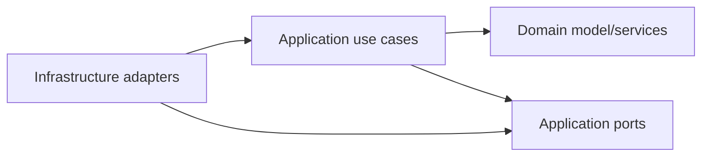

# 04 — Clean Architecture portada desde apps Go a Java

## Versión de Java elegida

El baseline ejecutable actual es Java 21 LTS (`--release 21`) por compatibilidad del tooling de build/test. Java 25 LTS queda documentado como objetivo arquitectónico cuando JMH/Shadow/Karate/ArchUnit soporten classfile 25 sin fricción.

The clean way to articulate this:

> Para producción priorizaría una LTS moderna —hoy Java 25— salvo que una feature de Java 26 justifique adoptar la release feature. Lo importante es no mezclar “última versión” con “mejor versión operable”.

## Patron observado en apps Go con layout enterprise

En el layout enterprise Go canonico se repite una estructura clara:

```text
cmd/main.go
internal/application/usecases
internal/domain/entities
internal/domain/repositories
internal/infrastructure/controllers
internal/infrastructure/consumers
internal/infrastructure/repositories
tests
```

La traducción a Java quedó así (layout actual del PoC, alineado raja tabla al layout Go):

```text
cmd/
  RiskApplication.java               ← cmd/main.go en Go

config/
  RiskApplicationFactory.java        ← bootstrap / wiring manual

domain/
  entity/                            ← internal/domain/entities/ en Go
  repository/                        ← internal/domain/repositories/ en Go (port out interfaces)
  usecase/                           ← internal/domain/usecases/ en Go (port in interfaces)
  service/                           ← lógica de dominio pura
  rule/                              ← reglas de fraude

application/
  usecase/risk/                      ← internal/application/usecases/ en Go (impls por agregado)
  mapper/                            ← internal/application/mappers/ en Go
  dto/
  common/

infrastructure/
  controller/                        ← internal/infrastructure/controllers/ en Go (inbound CLI)
  consumer/                          ← internal/infrastructure/consumers/ en Go (inbound async)
  repository/                        ← internal/infrastructure/repositories/ en Go (outbound impls)
    event/
    feature/
    idempotency/
    log/
    ml/
    persistence/
  resilience/
  time/
```

## Mapeo Go (enterprise layout) → Java (este PoC)

| Go (enterprise layout)                       | Java (PoC)                                                  | Rol hexagonal          |
|----------------------------------------------|-------------------------------------------------------------|------------------------|
| `cmd/main.go`                                | `cmd/RiskApplication.java`                                  | bootstrap entry point  |
| `cmd/main.go` (wiring)                       | `config/RiskApplicationFactory.java`                        | DI manual              |
| `internal/domain/entities/`                  | `domain/entity/`                                            | entidades / VOs        |
| `internal/domain/repositories/` (interfaces) | `domain/repository/` (interfaces)                          | port out               |
| `internal/domain/usecases/` (interfaces)     | `domain/usecase/` (interfaces)                             | port in                |
| `internal/domain/services/`                  | `domain/service/`                                           | domain services        |
| `internal/application/usecases/`             | `application/usecase/risk/`                                 | use case impls         |
| `internal/application/mappers/`              | `application/mapper/`                                       | mappers DTO↔entity     |
| `internal/infrastructure/controllers/`       | `infrastructure/controller/`                                | inbound adapter (CLI)  |
| `internal/infrastructure/consumers/`         | `infrastructure/consumer/`                                  | inbound adapter (async)|
| `internal/infrastructure/repositories/`      | `infrastructure/repository/{event,feature,ml,idempotency,persistence}/` | outbound adapters |

Convenciones de naming en Java vs Go:
- Go usa `FooRepositoryInterface`, `CreateFooUseCaseInterface`. En Java no agregamos sufijo `Interface` — es no idiomático. El javadoc `/** Port out — ... */` preserva la semántica hexagonal.
- Sub-package por agregado en `application/usecase/risk/` sienta la convención aunque solo haya un agregado.

## Regla de dependencias

La dirección correcta es:



- Dominio no conoce infraestructura.
- Aplicación orquesta casos de uso y depende de puertos.
- Infraestructura implementa puertos.
- Bootstrap arma dependencias.

## Principios aplicados

### Clean Architecture

- `domain/usecase/EvaluateRiskUseCase` es el puerto de entrada (port in).
- `application/usecase/risk/EvaluateTransactionRiskService` es la implementación del caso de uso.
- `domain/repository/{FeatureProvider,RiskModelScorer,DecisionEventPublisher,DecisionIdempotencyStore,ClockPort}` son puertos de salida (port out).
- Adaptadores in-memory/fake en `infrastructure/repository/` implementan los detalles externos.

### Hexagonal Architecture

- El motor no sabe si entra por CLI, REST, Kafka/SQS o test.
- El ML puede ser un HTTP client, SageMaker, Lambda o fake.
- Los eventos pueden ir a SNS/SQS, Kafka, outbox o consola.

### SOLID

- SRP: reglas, scoring, fallback, idempotencia y eventos están separados.
- OCP: agregar una regla nueva no modifica el use case; se registra en bootstrap.
- DIP: el use case depende de interfaces, no de adaptadores concretos.

### DDD táctico liviano

- Value Objects: `TransactionId`, `CustomerId`, `Money`, `CorrelationId`, `IdempotencyKey`.
- Entidades/eventos de dominio: `RiskDecision`, `DecisionEvent`, `DecisionTrace`.
- Servicios de dominio: `RuleBasedDecisionPolicy`, `ScoreDecisionPolicy`, `FallbackDecisionPolicy`.

## How to Articulate This

> Separaría el dominio de decisión de los detalles de runtime. Lambda, EKS, SNS, SQS, HTTP o ML serving son adaptadores. El corazón debería ser un use case determinístico, testeable, con puertos claros para features, scoring, eventos, clock e idempotencia. Eso facilita migrar Lambda a EKS sin reescribir reglas de fraude.

## Por qué sirve para Lambda → EKS

Si el dominio está acoplado a Lambda handlers, SDKs o controladores, migrar a EKS se vuelve una reescritura. Si está separado:

- Cambia el adapter de entrada.
- Cambia el packaging/deployment.
- Cambian observabilidad y configuración.
- El caso de uso y dominio permanecen estables.

Frase fuerte:

> La migración sana no es “pasar Lambdas a pods”; es aislar el core de decisión para que el runtime sea reemplazable.
