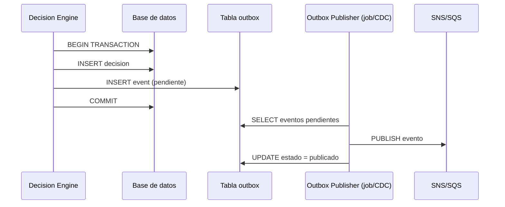

# 06 — Eventos versionados: diseño, evolución y migración

## 1. El principio central

> "El evento es una API pública, no un DTO interno."

Un evento que sale del servicio y es consumido por otro equipo, otro sistema o un pipeline de data science es un contrato. No se puede renombrar un campo sin una estrategia de migración. No se puede agregar un campo required sin romper consumidores existentes. No se puede cambiar el tipo de un campo sin versionar.

---

## 2. Estructura base de un evento bien diseñado

Campos de envelope (siempre presentes, sin importar el tipo de evento):

```json
{
  "eventId":        "evt-7a3f2c1e-4d8b-11ef-9abc-0242ac130003",
  "correlationId":  "corr-ab12cd34-5678-90ef-ghij-1234567890ab",
  "idempotencyKey": "txn-NX-20240507-1234567890-001",
  "eventType":      "DecisionEvaluated",
  "eventVersion":   "1",
  "occurredAt":     "2024-05-07T14:32:10.123Z",
  "producer":       "risk-decision-engine",
  "schemaRef":      "urn:riskplatform:risk:DecisionEvaluated:1"
}
```

Reglas:
- `eventId`: UUID v4, único globalmente. Identifica el evento, no la transacción.
- `correlationId`: propaga el ID de la operación raíz end-to-end.
- `idempotencyKey`: clave que el consumidor usa para deduplicar si recibe el evento dos veces.
- `eventVersion`: string o int, parte del schema. Cambiar su valor es un contrato.
- `occurredAt`: timestamp en UTC ISO-8601, con milisegundos.
- `producer`: identifica el servicio emisor para tracing y soporte.

---

## 3. Payload v1: `DecisionEvaluated`

```json
{
  "eventId":        "evt-7a3f2c1e-4d8b-11ef-9abc-0242ac130003",
  "correlationId":  "corr-ab12cd34-5678-90ef-ghij-1234567890ab",
  "idempotencyKey": "txn-NX-20240507-1234567890-001",
  "eventType":      "DecisionEvaluated",
  "eventVersion":   "1",
  "occurredAt":     "2024-05-07T14:32:10.123Z",
  "producer":       "risk-decision-engine",
  "payload": {
    "transactionId":   "txn-NX-20240507-1234567890",
    "customerId":      "cust-00001234",
    "decision":        "APPROVE",
    "rulesetVersion":  "2024-04-15-v3",
    "modelVersion":    null,
    "score":           null,
    "fallbackApplied": false,
    "evaluatedAt":     "2024-05-07T14:32:10.120Z"
  }
}
```

Características de v1:
- `modelVersion` y `score` son opcionales (pueden ser null si no se usó ML).
- `fallbackApplied` indica si se activó un fallback de reglas o score.
- Sin campos de features (aún no se auditan).

---

## 4. Payload v2: `DecisionEvaluated` — backward-compatible

En v2 se agregan campos para auditoría más detallada y soporte de explicabilidad. Todos los campos nuevos son opcionales para no romper consumidores que solo conocen v1.

```json
{
  "eventId":        "evt-9b5e3d2f-4d8b-11ef-9abc-0242ac130004",
  "correlationId":  "corr-ab12cd34-5678-90ef-ghij-1234567890ab",
  "idempotencyKey": "txn-NX-20240507-1234567890-001",
  "eventType":      "DecisionEvaluated",
  "eventVersion":   "2",
  "occurredAt":     "2024-05-07T14:32:10.123Z",
  "producer":       "risk-decision-engine",
  "payload": {
    "transactionId":   "txn-NX-20240507-1234567890",
    "customerId":      "cust-00001234",
    "decision":        "APPROVE",
    "rulesetVersion":  "2024-04-15-v3",
    "modelVersion":    "fraud-lgbm-v2.3.1",
    "score":           0.12,
    "fallbackApplied": false,
    "evaluatedAt":     "2024-05-07T14:32:10.120Z",
    "featureVersion":  "feature-set-v4",
    "rulesTriggered":  ["rule-velocity-24h", "rule-new-device"],
    "mlLatencyMs":     42,
    "fallbackReason":  null,
    "engineVersion":   "1.8.2",
    "channelId":       "mobile-app"
  }
}
```

Campos nuevos en v2 (todos opcionales):
- `featureVersion`: identifica qué set de features se usó para el modelo.
- `rulesTriggered`: lista de reglas que contribuyeron a la decisión.
- `mlLatencyMs`: latencia del scoring ML en ms (útil para auditoría de SLA).
- `fallbackReason`: si `fallbackApplied` es true, explica por qué (timeout, circuit open, error).
- `engineVersion`: versión del motor de decisión, no solo del ruleset.
- `channelId`: canal de entrada (mobile, web, pos, api).

Un consumidor que solo conoce v1 ignora los campos extras. Funciona sin cambios.

---

## 5. Reglas de evolución de contratos

### Lo que SE puede hacer sin romper consumidores

- Agregar campos opcionales (con valor default o null).
- Agregar valores nuevos a enums si los consumidores ignoran valores desconocidos.
- Cambiar el orden de campos en JSON (los parsers no dependen del orden).
- Agregar nuevos tipos de eventos (los consumidores filtran por `eventType`).

### Lo que NO se puede hacer sin versionar

- Renombrar un campo (rompe deserialización existente).
- Cambiar el tipo de un campo (string a int, objeto a array).
- Eliminar un campo que ya se usa.
- Hacer required un campo que antes era opcional.
- Cambiar el significado semántico de un campo sin nueva versión.

Frase útil:
> "Agregar es gratis, cambiar o borrar tiene costo de migración."

---

## 6. Schema registry: qué problema resuelve

Sin schema registry, el contrato vive solo en la documentación o en el código del productor. Los consumidores descubren que algo cambió cuando falla la deserialización en producción.

Un schema registry (Confluent Schema Registry, AWS Glue Schema Registry, Apicurio) ofrece:

- Registro centralizado de schemas por tipo y versión.
- Validación de compatibilidad en publish (no se puede publicar un schema que rompa backward compatibility).
- Lookup de schema por `schemaRef` en el consumer antes de deserializar.
- Historial de versiones y deprecaciones.

Si no hay schema registry disponible, la alternativa mínima viable es:
1. Schemas versionados en un repo central (por ejemplo, `schemas/DecisionEvaluated/v1.json`).
2. Validación en CI/CD: el pipeline falla si el productor rompe el contrato del schema publicado.
3. Consumer contract tests (Pact o equivalente): los consumidores publican sus contratos y el productor los verifica.

---

## 7. Outbox pattern: publicación confiable de eventos

El problema sin outbox: si el servicio persiste la decisión en la DB y luego publica el evento a SNS/SQS, puede haber una ventana donde la decisión existe pero el evento no se publicó (crash, timeout, error de red). Resultado: consumidores sin datos, auditoría incompleta.



El outbox garantiza que si la transacción DB hace commit, el evento eventualmente se publica. El publisher puede ser:
- Un job periódico (polling).
- Change Data Capture (CDC) con Debezium o similar.
- Un thread interno con retry.

Lo importante: el publisher es idempotente. Si el evento se publica dos veces (retry), el consumidor usa el `idempotencyKey` para deduplicar.

Frase útil:
> "Outbox no es overkill: es la única forma de garantizar que el evento llega si la base de datos confirma la decisión."

---

## 8. Estrategia de migración cuando hay que romper el contrato

A veces el cambio es inevitable (cambio estructural del dominio, requirement de auditoría, nuevos campos required). El proceso:

### Dual-publish

El productor publica el mismo evento en v1 y v2 durante la ventana de migración:

```
Semana 1-4:  Productor publica v1 y v2. Consumidores migran a v2 a su ritmo.
Semana 5:    Se verifica que ningún consumidor activo lea v1 (métricas de consumo por versión).
Semana 6:    Se depreca v1. El productor deja de emitir v1.
```

### Deprecation window

- Anunciar deprecación con al menos 4 semanas de anticipación.
- Publicar en el canal de ingeniería, no solo en el changelog del servicio.
- Monitorear consumidores activos por versión (si hay schema registry, esto es directo).
- No cortar v1 sin confirmar que todos los consumidores migraron.

### Version routing en el consumer

Un consumer bien diseñado puede manejar múltiples versiones:

```java
// Pseudocódigo Java
switch (event.getEventVersion()) {
    case "1" -> handleV1(event);
    case "2" -> handleV2(event);
    default  -> log.warn("Unknown version, skipping: {}", event.getEventVersion());
}
```

Esto permite que el consumer migre gradualmente sin downtime.
