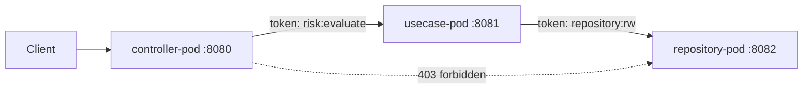

# 06 — App Vert.x separando pods locales por permisos

Se creó una app aparte en:

```text
${REPO_ROOT}/poc/vertx-risk-platform
```

## Qué modela

Tres procesos Vert.x separados:

- `controller-pod` en `:8080`.
- `usecase-pod` en `:8081`.
- `repository-pod` en `:8082`.

La separación no es cosmética: cada pod tiene permisos distintos.



## Architectural Relevance

Esto conecta directamente con migración Lambda → EKS:

- Controllers/adapters escalan distinto al motor de decisión.
- Use cases pueden tener CPU/memoria y HPA propios.
- Repositories/persistencia tienen permisos más restringidos.
- Se reduce blast radius.
- Se puede aplicar NetworkPolicy e IAM por ServiceAccount.

Frase útil:

> Separar pods no es solo escalar distinto; es marcar boundaries operativos y de seguridad: quién puede recibir tráfico público, quién puede ejecutar decisión y quién puede tocar persistencia.

## Ejecutar

```bash
cd ${REPO_ROOT}/poc/vertx-risk-platform
./scripts/run-local-pods.sh
./scripts/smoke.sh
./scripts/stop-local-pods.sh
```

## Manifiestos EKS locales

Hay ejemplos en:

```text
poc/vertx-risk-platform/k8s-local
```

Incluyen:

- ServiceAccounts separados.
- Deployments separados.
- NetworkPolicy controller→usecase y usecase→repository.
