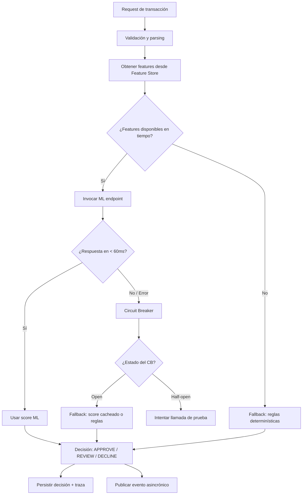

# 08 — ML en el camino crítico: patrones, feature store y operación

## 1. El principio

> "El modelo no puede ser single point of failure en el flujo de pago."

Un modelo ML es útil para mejorar la calidad de decisiones, pero en un sistema de fraude en tiempo real tiene que ser una dependencia opcional y controlada, no un cuello de botella sin salida.

---

## 2. Dos patrones: ML en camino crítico vs asincrónico

### Patrón A: ML como dependencia opcional en el camino crítico

El modelo se consulta dentro del tiempo de vida del request, pero con timeout estricto, circuit breaker y fallback. Si falla o tarda demasiado, la decisión continúa sin él.



Puntos clave:
- Timeout del ML: 60ms máximo (ajustar según budget del sistema).
- Circuit breaker con ventana deslizante: si falla > 50% en 10s, abre el circuito.
- Fallback en orden de preferencia (ver sección 5).
- La traza registra si se usó score real, score cacheado o fallback de reglas.

### Patrón B: ML completamente asincrónico

El request toma una decisión preliminar con reglas determinísticas y publica un evento. Un consumer asincrónico ejecuta el modelo y, si la decisión cambia, genera una corrección (challenge, review escalado).

Ventaja: el camino crítico no depende del ML en absoluto.
Desventaja: la decisión inicial es conservadora y puede generar más falsos positivos (más REVIEW), o la corrección llega después de que la transacción ya fue procesada (ventana de fraude).

En fraude de tiempo real donde la ventana de decisión es < 1s, el patrón A con fallback robusto es más adecuado. El patrón B sirve para análisis post-transacción (enrichment, alertas de fraude diferidas).

---

## 3. Feature store: por qué importa

### Problema sin feature store

Cada request calcula las mismas features desde cero: consultas a DB de historial, cómputo de velocidades (transacciones en las últimas 24h), agregaciones por dispositivo, etc. Esto es lento, redundante y costoso.

### Qué es un feature store

Un feature store es un sistema que precalcula y almacena features listas para consumo en tiempo de inferencia. Tiene dos capas:

- Offline store: features históricas calculadas en batch (Spark, dbt), almacenadas en S3/Redshift para entrenamiento de modelos.
- Online store: features recientes calculadas de forma continua y servidas en < 10ms. Tecnología típica: Redis, DynamoDB, Cassandra, o servicios gestionados como Feast/Tecton/SageMaker Feature Store.

Para fraude en tiempo real:

| Feature | Fuente | Latencia esperada |
|---|---|---|
| Número de transacciones en 1h para el cliente | Online store (Redis) | < 5 ms |
| Monto promedio histórico del cliente | Online store (precalculado) | < 5 ms |
| Score de dispositivo | Online store (actualizado por evento de login) | < 5 ms |
| Estado de bloqueo del cliente | DB primaria o cache con TTL corto | < 10 ms |
| Velocidad de transacciones desde mismo IP en 10min | Online store (sliding window) | < 5 ms |

Frase útil:
> "Si el modelo necesita features que tardan 200ms en calcular, el problema no es el modelo: es que no tenemos feature store."

### Consistencia offline/online (training-serving skew)

Un riesgo común: el modelo se entrena con features calculadas de una forma y sirve con features calculadas de otra. El resultado es degradación silenciosa del modelo en producción.

Solución: usar la misma definición de feature para training y serving, gestionada centralmente en el feature store.

---

## 4. Identificadores en la traza para auditoría

Toda decisión que involucre ML debe registrar:

```json
{
  "transactionId":  "txn-NX-20240507-1234567890",
  "correlationId":  "corr-ab12cd34",
  "modelId":        "fraud-lgbm",
  "modelVersion":   "2.3.1",
  "featureVersion": "feature-set-v4",
  "featuresUsed": {
    "txn_count_1h":      3,
    "avg_amount_30d":    150.50,
    "device_risk_score": 0.21,
    "ip_velocity_10m":   1
  },
  "score":          0.12,
  "scoreThreshold": 0.50,
  "fallbackApplied": false,
  "mlLatencyMs":    42
}
```

Esto permite:
- Reproducir exactamente qué predijo el modelo para esa transacción.
- Detectar cuándo un cambio de `featureVersion` o `modelVersion` afectó las decisiones.
- Responder ante regulación o auditoría interna.

---

## 5. Orden de fallback cuando el modelo no responde

Cuando el ML falla o supera el timeout, la decisión no se cae: se degrada ordenadamente.

```
1. Score cacheado del cliente (si hay un score reciente < N minutos)
   -> Precondición: el score es válido para el tipo de transacción
   -> Riesgo: el cache puede estar desactualizado si el cliente acaba de hacer algo sospechoso

2. Reglas determinísticas solamente
   -> Más conservadoras, más falsos positivos en clientes legítimos
   -> Sin necesidad de ML

3. Política conservadora por tipo de transacción
   -> Montos bajos: APPROVE directo (riesgo bajo sin ML)
   -> Montos altos: REVIEW (no DECLINE automático sin score)
   -> Transacción en lista negra o regla dura: DECLINE (sin ML requerido)
```

La política de fallback debe estar documentada, versionada y ser auditable. En la traza debe constar `fallbackApplied: true` y `fallbackReason: "ml_timeout"` o `"circuit_open"`.

---

## 6. Versionado de modelo y rollback con feature flags

### Estrategia de rollout

No se despliega un modelo nuevo directo al 100% del tráfico. El proceso:

```
Semana 1: Shadow mode (nuevo modelo corre en paralelo, no afecta decisiones, se comparan outputs)
Semana 2: Canary 5% del tráfico real (feature flag = "ml_v2_canary_pct: 5")
Semana 3: Canary 20%
Semana 4: 100% si métricas están bien
```

### Feature flags para control de modelo

```yaml
# Configuración de feature flags (LaunchDarkly, AWS AppConfig, etc.)
ml_model_version: "2.3.1"
ml_canary_pct: 20
ml_timeout_ms: 60
ml_circuit_breaker_enabled: true
ml_fallback_policy: "cached_score_then_rules"
```

Cambiar `ml_model_version` de "2.3.1" a "2.2.0" es suficiente para hacer rollback sin redesplegar código.

---

## 7. Drift detection: saber cuándo el modelo se degrada

Un modelo entrenado en datos de enero puede degradarse en junio si los patrones de fraude cambian. El monitoreo de drift detecta esto antes de que impacte el negocio.

### Tipos de drift relevantes

| Tipo | Descripción | Cómo detectarlo |
|---|---|---|
| Feature drift (covariate shift) | La distribución de features de entrada cambia | PSI (Population Stability Index) por feature, comparando producción vs training |
| Label drift | La distribución de outcomes cambia (más fraudes de un tipo nuevo) | KS-test sobre distribución de scores, tasa de REVIEW vs DECLINE en el tiempo |
| Concept drift | La relación entre features y fraude cambia | Degradación de métricas offline (precision/recall en datos recientes etiquetados) |

### PSI: Population Stability Index

PSI < 0.1: no hay drift significativo.
PSI 0.1–0.2: monitoreo más frecuente recomendado.
PSI > 0.2: revisar modelo, posible reentrenamiento necesario.

Se calcula comparando la distribución de una feature en producción vs la distribución en el set de entrenamiento, por deciles.

### Alertas básicas de drift

- Score distribution: si el histograma de scores en producción se desplaza significativamente vs el baseline, es señal.
- Tasa de fallback: si el ML empieza a fallar más (timeouts, errores), puede ser señal de un problema en el serving.
- Decision distribution: si el ratio APPROVE/REVIEW/DECLINE cambia bruscamente sin un evento de negocio que lo explique.

---

## 8. Explicabilidad para auditoría

En fraude, la explicabilidad no es solo un nice-to-have: puede ser un requerimiento regulatorio o de soporte al cliente.

### Lo que se puede hacer en batch (sin impacto en latencia)

- Calcular SHAP values para decisiones históricas en batch diario.
- Almacenar top-N features con mayor contribución al score por transacción.
- Usar LIME para explicaciones locales en casos de análisis manual (fraude confirmado, falso positivo reportado).

### Lo que NO conviene hacer en tiempo real

- Calcular SHAP en el camino crítico: SHAP tree explainer para LightGBM puede tardar 5–20ms extra, lo cual afecta el budget.
- Exponer explicaciones al cliente en tiempo real (riesgo de gaming del sistema).

### Modelo de explicación guardada

```json
{
  "transactionId": "txn-NX-20240507-1234567890",
  "score":         0.12,
  "decision":      "APPROVE",
  "topFactors": [
    { "feature": "txn_count_1h",      "contribution": -0.08, "direction": "reduces_risk" },
    { "feature": "device_risk_score", "contribution":  0.03, "direction": "increases_risk" },
    { "feature": "avg_amount_30d",    "contribution": -0.02, "direction": "reduces_risk" }
  ],
  "explanationGeneratedAt": "2024-05-07T15:00:00Z",
  "explanationMethod": "shap_tree_batch_v1"
}
```

Esto se calcula en batch y se almacena en el sistema de auditoría, no en el camino crítico.
