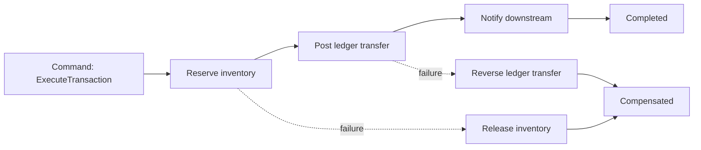

# 41 — CQRS + Event Sourcing simple y demo avanzada transaccional

Este documento es una guía didáctica para explicar **CQRS**, **Event Sourcing**, **proyecciones** y snapshots con un ejemplo simple de cuenta bancaria. Después separa una demo avanzada para **sagas**, TigerBeetle y EDA.

Idea central para la discusión técnica:

> El endpoint de riesgo necesita responder rápido y de forma síncrona; los procesos financieros y auditables alrededor del pago pueden modelarse como comandos, eventos, proyecciones, sagas compensables y mensajes idempotentes.

---

## 0. Dos niveles de ejemplo

Para no mezclar conceptos, las PoCs NestJS/Hono quedan separadas en dos recorridos:

### Nivel 1 — cuenta bancaria simple

Es el ejemplo principal para explicar CQRS + Event Sourcing:

```text
POST /accounts/:id/open      -> OpenAccountCommand -> AccountOpened
POST /accounts/:id/deposit   -> DepositMoneyCommand -> MoneyDeposited
GET  /accounts/:id           -> GetAccountBalanceQuery -> balance rehidratado + proyección
GET  /accounts/:id/events    -> Event Store append-only
```

Componentes:

- `OpenAccountCommand`
- `DepositMoneyCommand`
- `GetAccountBalanceQuery`
- `AccountOpened`
- `MoneyDeposited`
- `EventStore` in-memory
- `BalanceProjection`
- `BankAccount.rehydrate()`
- `BankAccount.snapshot()` como concepto de snapshot

### Nivel 2 — demo avanzada separada

El caso de pago distribuido queda bajo `/transactions/*`:

- Saga orquestada.
- Compensaciones.
- Ledger boundary con TigerBeetle.
- EDA con BullMQ/Valkey/Webdis.
- Idempotencia por `domainId` + checksum MD5.

TigerBeetle no se usa para explicar Event Sourcing simple. Sí aporta para hablar de ledger real, transferencias idempotentes, cuentas débito/crédito, invariantes contables y movimientos financieros de alta performance.

---

## 1. CQRS en una frase

**CQRS** significa **Command Query Responsibility Segregation**: separar el modelo de escritura del modelo de lectura.

- **Commands**: expresan intención y modifican estado.
- **Queries**: leen modelos optimizados para consulta.

### Sin CQRS

```typescript
class TransactionService {
  async approve(input: ApproveInput) {
    return db.transactions.insert(input);
  }

  async getStatus(transactionId: string) {
    return db.transactions.find(transactionId);
  }
}
```

### Con CQRS

```typescript
export class DepositMoneyCommand {
  constructor(
    public readonly accountId: string,
    public readonly amountCents: string,
    public readonly currency: string,
    public readonly correlationId: string,
  ) {}
}

export class GetAccountBalanceQuery {
  constructor(public readonly accountId: string) {}
}
```

El command handler valida invariantes, emite eventos y actualiza el write model. El query handler lee una proyección preparada para consulta rápida.

---

## 2. Por qué aplica a riesgo y pagos

En una plataforma de riesgo/pagos, escritura y lectura suelen optimizar objetivos distintos.

### Escritura

```http
POST /accounts/:id/open
POST /accounts/:id/deposit
```

Puede disparar:

- decisión de riesgo;
- reserva de fondos/inventario;
- movimiento contable;
- auditoría;
- eventos downstream;
- compensaciones si un paso posterior falla.

### Lectura

```http
GET /accounts/:id
GET /accounts/:id/events
```

Puede necesitar una vista desnormalizada con:

- estado de riesgo;
- estado de pago;
- estado de ledger;
- timestamps por paso;
- causa de rechazo o compensación;
- correlation ID y trace.

El modelo seguro para escribir no tiene por qué ser el modelo rápido para leer.

---

## 3. Event Sourcing en una frase

**Event Sourcing** guarda la historia de hechos de negocio en lugar de sobrescribir sólo el estado actual.

Modelo tradicional:

```json
{
  "accountId": "merchant-1",
  "balanceCents": "150000"
}
```

Modelo event-sourced:

```json
{ "type": "AccountOpened", "accountId": "merchant-1" }
{ "type": "MoneyDeposited", "amountCents": "100000" }
{ "type": "MoneyDeposited", "amountCents": "50000" }
```

El balance se reconstruye aplicando eventos:

```text
0 + 100000 + 50000 = 150000
```

---

## 4. Event Store mínimo

Un event store útil necesita metadata operacional, no sólo payload:

```sql
CREATE TABLE events (
  id UUID PRIMARY KEY,
  aggregate_id TEXT NOT NULL,
  event_type TEXT NOT NULL,
  event_version INT NOT NULL,
  payload JSONB NOT NULL,
  correlation_id TEXT NOT NULL,
  occurred_at TIMESTAMPTZ NOT NULL
);
```

Campos importantes:

| Campo | Por qué importa |
|---|---|
| `id` / `eventId` | idempotencia de consumidores |
| `aggregate_id` | replay por aggregate |
| `event_type` | routing y handlers |
| `event_version` | evolución compatible de contratos |
| `payload` | hecho de negocio |
| `correlation_id` | trazabilidad cross-service |
| `occurred_at` | auditoría y orden aproximado |

---

## 5. Aggregate + rehidratación

Un aggregate event-sourced reconstruye estado aplicando eventos previos.

```typescript
type AccountEvent =
  | { type: 'AccountOpened'; accountId: string; currency: 'ARS' | 'USD' }
  | { type: 'LedgerTransferPosted'; accountId: string; amountCents: bigint };

class AccountAggregate {
  private balanceCents = 0n;
  private opened = false;

  apply(event: AccountEvent) {
    if (event.type === 'AccountOpened') this.opened = true;
    if (event.type === 'LedgerTransferPosted') this.balanceCents += event.amountCents;
  }

  loadFromHistory(events: AccountEvent[]) {
    events.forEach((event) => this.apply(event));
  }

  balance() {
    return this.balanceCents;
  }
}
```

En una demo, la rehidratación in-memory alcanza. En producción hay que pensar en snapshots, particionamiento, ordering por aggregate y replay controlado.

---

## 6. Proyecciones/read models

Una **proyección** transforma eventos en una vista optimizada para lectura.

```text
Event Store
   │
   ▼
Projection Handler
   │
   ▼
Read Model: account_balances, transaction_status, audit_view
```

Ejemplo conceptual:

```typescript
class BalanceProjection {
  async handle(event: LedgerTransferPostedEvent) {
    await readDb.accountBalances.upsert({
      accountId: event.creditAccountId,
      deltaCents: event.amountCents,
      lastEventId: event.eventId,
    });
  }
}
```

En el repo:

- `poc/nestjs-distributed-transactions/src/internal/infrastructure/cqrs/event-sourcing.handlers.ts`
- `poc/nestjs-distributed-transactions/src/internal/infrastructure/repository/in-memory-account-projection.repository.ts`

---

## 7. Snapshotting

Problema: una cuenta o aggregate con cientos de miles de eventos no debería reconstruirse desde cero en cada operación.

Snapshot:

```json
{
  "aggregateId": "merchant-1",
  "balanceCents": "2450000",
  "version": 5000
}
```

Replay eficiente:

```text
snapshot v5000 + eventos 5001..5010 = estado actual
```

Regla práctica: agregar snapshots cuando el replay impacta latencia, costo operativo o tiempos de recuperación.

---

## 8. Patrón Saga y compensaciones

El **patrón Saga** es un diseño arquitectónico para sistemas distribuidos y microservicios. En lugar de usar una única transacción global, divide un proceso complejo en una secuencia de transacciones locales. Si un paso falla, ejecuta acciones compensatorias para deshacer o neutralizar los cambios anteriores.

Matices importantes:

- No es un rollback ACID global.
- Cada paso confirma su propia transacción local.
- La “vuelta atrás” ocurre mediante **compensating transactions**.
- Requiere idempotencia, trazabilidad y manejo claro de estados.
- Puede implementarse con **orquestación** (un coordinador decide el próximo paso) o **coreografía** (cada servicio reacciona a eventos).

En esta PoC mostramos una **Saga orquestada**: el use case actúa como coordinador del proceso.



Puntos clave:

- Una compensación no es rollback ACID global.
- Cada paso debe ser idempotente.
- Cada evento/step debe tener `correlationId`.
- El ledger puede ser fuertemente consistente aunque el workflow completo sea eventualmente consistente.

En la PoC:

- `SUCCESS` completa todos los pasos.
- `FAIL_AFTER_INVENTORY` libera la reserva.
- `FAIL_AFTER_LEDGER` genera transferencia inversa.
- `FAIL_NOTIFICATION` marca falla y compensa lo necesario.

---

## 9. TigerBeetle en esta arquitectura

TigerBeetle encaja como **ledger**: el componente responsable de movimientos contables consistentes.

| Responsabilidad | Componente |
|---|---|
| Validar workflow de negocio | Saga orchestrator |
| Preservar movimientos contables | TigerBeetle |
| Publicar hechos auditables | Event Store / Outbox |
| Construir vistas de lectura | Projections |
| Responder queries rápidas | Read models |

Frase para discusión técnica:

> No usaría TigerBeetle como orquestador de negocio; lo usaría como ledger consistente detrás de un puerto, y dejaría compensaciones, timeouts y retries en la saga.

---

## 10. EDA con BullMQ, Valkey, Webdis e idempotencia

Para la PoC NestJS, EDA se mantiene pequeño y explícito:

```text
HTTP command
  → DomainMessage(domainId, eventType, payload, checksum=md5)
  → BullMQ queue backed by Valkey
  → Worker / manual processor
  → Valkey idempotency key
```

El ID del dominio viaja dentro del mensaje:

```json
{
  "domainId": "tx-eda-1",
  "domainType": "transaction",
  "eventType": "TransactionAccepted",
  "checksumAlgorithm": "md5",
  "checksum": "<stable-md5>",
  "correlationId": "demo-eda",
  "payload": {
    "amountCents": 12050,
    "merchantId": "merchant-1"
  }
}
```

La clave de idempotencia se deriva de identidad de negocio + checksum:

```text
<domainType>:<domainId>:<md5-checksum>
```

Esto demuestra dos protecciones:

1. delivery duplicado del mismo mensaje de negocio se saltea;
2. mismo ID de dominio con payload distinto produce otro checksum y permite detectar conflicto semántico.

Dependencias locales:

- **Valkey** como backend Redis-compatible para cola e idempotencia;
- **BullMQ** para persistir jobs en Valkey;
- **Webdis** como puente HTTP simple sobre Valkey para inspección/demo.

Endpoints de demo:

- `POST /transactions/eda/messages` publica un mensaje de dominio;
- `POST /transactions/eda/jobs/{jobId}/process` procesa manualmente un job y escribe el registro de idempotencia.

---

## 11. Cuándo usar CQRS/Event Sourcing

Buenos candidatos:

- fintech;
- wallets;
- ledgers;
- core bancario;
- sistemas contables;
- PSP/adquirencia;
- loyalty/puntos;
- pagos con auditoría fuerte.

Evitar Event Sourcing para:

- CRUD administrativo simple;
- catálogos básicos;
- CMS;
- configuración/preferencias sin auditoría crítica;
- backoffice sin necesidad real de replay o time travel.

Arquitectura incremental recomendada:

```text
Clean Architecture
+ DDD light
+ CQRS donde el read model difiere del write model
+ Outbox Pattern para publicar eventos confiables
+ Projections para consultas rápidas
```

Sólo dominios críticos deberían evolucionar a:

```text
Event Sourcing
+ snapshots
+ proyecciones especializadas
+ replay/rebuild operable
+ versionado estricto de eventos
```

---

## 12. Relación con las PoCs del repo

| Tema | Dónde verlo |
|---|---|
| Decisión síncrona de riesgo | `poc/no-vertx-clean-engine` y PoCs Vert.x |
| Outbox/eventos fuera del path crítico | `poc/no-vertx-clean-engine`, PoCs Vert.x |
| CQRS/Event Sourcing simple | `POST /accounts/:id/open`, `POST /accounts/:id/deposit`, `GET /accounts/:id`, `GET /accounts/:id/events` en ambas PoCs |
| Saga/compensación avanzada | `/transactions/sagas` en `poc/nestjs-distributed-transactions` y `poc/hono-distributed-transactions` |
| TigerBeetle boundary avanzado | `src/internal/infrastructure/tigerbeetle` en ambas PoCs |
| EDA/idempotencia con BullMQ + Valkey | `poc/nestjs-distributed-transactions` y `poc/hono-distributed-transactions` |
| Preguntas de discusión técnica | `vault/05-Methodology/Architecture-Question-Bank.md` |

---

## 13. Resumen para decirlo en voz alta

CQRS separa escritura y lectura. Event Sourcing guarda la historia de hechos, no sólo el estado final. Para explicarlo, alcanza con una cuenta bancaria que emite `AccountOpened` y `MoneyDeposited`, rehidrata balance desde eventos y mantiene una proyección. Sagas, TigerBeetle y EDA quedan como demo avanzada: workflows distribuidos con compensaciones, ledger financiero e idempotencia de mensajes.

Para el laboratorio: el motor de riesgo decide rápido; las sagas, el ledger y los mensajes viven alrededor como workflows trazables, compensables, auditables e idempotentes.
