# 47 — Intervención de arquitectura en procesos de producto, tecnología y operación

Esta página descompone las capturas del flujo de trabajo en una representación textual y diagramas Mermaid. El objetivo es conservar el orden de las etapas y explicar dónde interviene arquitectura, no sólo dentro del desarrollo de software sino también en la validación de negocio, producto, UX, data, legal, marketing, QA y operación post-lanzamiento.

> Nota de alcance: los diagramas son una traducción fiel en estructura y orden, pero en formato Markdown/Mermaid para poder versionarlos, discutirlos y extenderlos.

> Archivo visual aparte: [`docs/diagrams/product-architecture-process-map.html`](diagrams/product-architecture-process-map.html). Ese HTML recompone el proceso en una estructura visual más cercana a las capturas originales.
>
> Canvas editable: [`docs/diagrams/product-architecture-process-map.excalidraw`](diagrams/product-architecture-process-map.excalidraw). Export estático: [`docs/diagrams/product-architecture-process-map.svg`](diagrams/product-architecture-process-map.svg).

## 1. Vista end-to-end del proceso

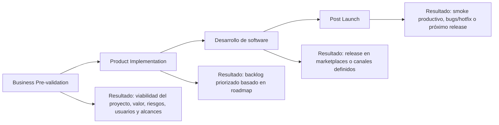

Arquitectura debería intervenir como función transversal desde la prevalidación hasta post-launch. No aparece sólo para “diseñar la solución técnica”, sino para reducir riesgo, descubrir dependencias, validar restricciones, estimar impacto, definir guardrails y asegurar que el producto pueda operar de forma sostenible.

## 2. Megagráfico recompuesto

Este megagráfico recompone las cuatro capturas en un único flujo, respetando el orden general: **Business Pre-validation → Product Implementation → Desarrollo de software → Post Launch**. Se mantienen las bandas transversales, resultados y entregables principales para que pueda leerse como un mapa de punta a punta.

```mermaid
flowchart LR
  Start(("Kickoff general"))

  subgraph BP["1. Business Pre-validation"]
    direction TB
    BPIntro["Validar producto antes de desarrollo y lanzamiento: demanda real, valor, riesgos, usuarios y alcances"]
    BPK(("Kickoff"))
    BPKPlan["Planning: metas, tareas y tiempos"]

    subgraph BPStages["Etapas"]
      direction LR
      BPC["Comprehend"] --> BPZ["Conceptualize"] --> BPP["Prototype"]
    end

    subgraph BPComprehend["Comprehend - actividades"]
      direction TB
      BPC1["Benchmark de la competencia"]
      BPC2["Taller de requerimientos y necesidades"]
      BPC3["Verificar información con Omni / Research / Comercial / Producto / UX"]
      BPC4["Business Model Canvas Lean"]
    end

    subgraph BPConcept["Conceptualize - actividades"]
      direction TB
      BPZ1["User personas hipotéticas"]
      BPZ2["High level process mapping"]
      BPZ3["Value proposition Canvas"]
      BPZ4["Risk & assumptions mapping"]
      BPZ5["Business Revenue Model"]
      BPZ6["Storymapping Low fidelity"]
      BPZ7["Insight aplicaciones similares Tech"]
    end

    subgraph BPPrototype["Prototype - actividades"]
      direction TB
      BPP1["User flows"]
      BPP2["Wire flows"]
      BPP3["Sketches"]
      BPP4["Wireframes Low fidelity"]
      BPP5["Mockups PITCH"]
      BPP6["Prototipos"]
    end

    BPResult["Resultado: viabilidad del proyecto; panorama claro de valor, riesgos, usuarios y alcances; presentación a stakeholders"]
    BPBrief["Validation Brief"]
    subgraph BPDeliverables["Entregables"]
      direction TB
      BPD1["Product Brief: Context, Market Situation, revenue model & Benchmark"]
      BPD2["Análisis de riesgos desde perspectiva Tech"]
      BPD3["Tech Brief: Tech stack, considerations"]
      BPD4["Business model canvas V01"]
      BPD5["Value proposition canvas V01"]
      BPD6["User Personas hipotéticas"]
      BPD7["Risk and Assumptions"]
      BPD8["Prototypes"]
      BPD9["Validación de necesidades"]
      BPD10["Conclusion"]
    end

    BPIntro --> BPK
    BPKPlan -.-> BPK
    BPK --> BPStages
    BPC -.-> BPComprehend
    BPZ -.-> BPConcept
    BPP -.-> BPPrototype
    BPStages --> BPResult --> BPBrief --> BPDeliverables
  end

  subgraph PI["2. Product Implementation"]
    direction TB
    PILMD["Banda transversal: Legal / Marketing / Data"]
    PIK(("Kickoff"))
    PIKPlan["Planning: metas, tareas y tiempos"]

    subgraph PIStages["Etapas"]
      direction LR
      PIU["Understanding"] --> PIE["Empathizing"] --> PIM["Market Prevalidation"] --> PIP["Planning"] --> PIPR["Producción"] --> PIUX["UX Testing"]
    end

    subgraph PIUnderstanding["Understanding"]
      direction TB
      PIU1["Benchmark"]
      PIU2["Análisis de lo existente"]
      PIU3["Heurísticas"]
      PIU4["Lectura del brief"]
      PIU5["Análisis de data"]
      PIU6["Análisis factibilidad para el prototipo POC"]
      PIU7["Apoyar a que las reglas de negocio se cumplan"]
      PIU8["Feedback en diseño de componentes de software"]
      PIU9["Presupuesto para cada fase"]
    end

    subgraph PIEmpathizing["Empathizing"]
      direction TB
      PIE1["User personas"]
      PIE2["Customer Journey"]
      PIE3["Blueprints"]
      PIE4["Taller de requerimientos y necesidades"]
      PIE5["Matriz de priorización"]
      PIE6["Focus group"]
    end

    subgraph PIMarket["Market Prevalidation"]
      direction TB
      PIM1["Entrevistas"]
      PIM2["Encuestas"]
      PIM3["Market Situation de acuerdo a las necesidades"]
    end

    subgraph PIPlanning["Planning"]
      direction TB
      PIP1["Inventario de contenido"]
      PIP2["Arquitectura High Fidelity"]
      PIP3["Sitemap High Fidelity"]
      PIP4["Definición de lenguaje gráfico"]
      PIP5["Mapear dependencias existentes: proveedores y lógica del producto"]
      PIP6["Definición de alcances"]
      PIP7["Deadlines"]
      PIP8["Valoración expertos: reutilización de componentes"]
      PIP9["Validar equipo de desarrollo adecuado"]
      PIP10["Storymapping"]
      PIP11["Roadmap"]
      PIP12["Value proposition canvas 2.0"]
    end

    subgraph PIProduction["Producción"]
      direction TB
      PIPR1["Flujos de pantallas"]
      PIPR2["Wireframes High fidelity - Mockups"]
      PIPR3["Prototipos"]
      PIPR4["Revisiones con equipo Developers"]
      PIPR5["Sketches"]
      PIPR6["Componentes de design system"]
      PIPR7["User testing de acuerdo a funcionalidad"]
      PIPR8["User Stories"]
      PIPR9["Anotaciones técnicas"]
    end

    subgraph PIUXTesting["UX Testing"]
      direction TB
      PIUX1["Card sorting"]
      PIUX2["Tree testing"]
      PIUX3["Paper & click prototipo"]
      PIUX4["Naming"]
      PIUX5["Usabilidad"]
      PIUX6["UXT"]
      PIUX7["Paper & click prototipo"]
      PIUX8["A-B Testing"]
      PIUX9["Eye tracking"]
      PIUX10["Pruebas heurísticas"]
    end

    PIResult["Resultado: suministros para producir un product backlog priorizado basado en el roadmap"]

    PIKPlan -.-> PIK
    PILMD -. acompaña .-> PIStages
    PIK --> PIStages
    PIU -.-> PIUnderstanding
    PIE -.-> PIEmpathizing
    PIM -.-> PIMarket
    PIP -.-> PIPlanning
    PIPR -.-> PIProduction
    PIUX -.-> PIUXTesting
    PIStages --> PIResult
  end

  subgraph SD["3. Desarrollo de software"]
    direction TB
    SDIntro["Kickoff entre leads de Producto, UX y Tech; signoff técnico de insumos; incluir BI/Data desde el inicio cuando corresponda"]
    SDK(("Kickoff"))

    subgraph SDInputs["Insumos"]
      direction TB
      SDI1["Anotaciones técnicas"]
      SDI2["Documentación del proceso"]
      SDI3["Flujos / prototipos"]
      SDI4["Editables"]
      SDI5["Product Roadmap"]
      SDI6["Technical Details for Development"]
      SDI7["Tech Brief: Tech stack, considerations"]
      SDI8["Deadlines detallados"]
      SDI9["Planeación de data inputs según objetivos de negocio"]
      SDI10["Validación de User Stories"]
      SDI11["Listado y comportamiento de nuevos componentes en DS"]
    end

    subgraph SDStages["Etapas"]
      direction LR
      SDRP["Revisión Planning"] --> SDS["Sprints (n)"] --> SDUAT["UAT"] --> SDL["Launch"]
    end

    subgraph SDPlanning["Revisión Planning"]
      direction TB
      SDRP1["Asegurar herramientas y entendimientos necesarios"]
      SDRP2["Establecer stakeholders para revisión de sprints"]
    end

    subgraph SDSprints["Sprints"]
      direction TB
      SDS1["Ejecución bajo Scrum y artefactos"]
      SDS2["Daily Scrum"]
      SDS3["Sprint Review"]
      SDS4["DEMO"]
      SDS5["Sprint Retrospective"]
    end

    subgraph SDUatBox["UAT"]
      direction TB
      SDU1["User acceptance testing antes de cada release"]
      SDU2["Prioridades UAT / Producto"]
      SDU3["Plan de acción Producto / Tech"]
      SDU4["UAT"]
    end

    subgraph SDLaunch["Launch"]
      direction TB
      SDL1["Deployment de aplicación a marketplaces o release de nuevos features"]
    end

    SDResult["Resultado: software release en marketplaces"]

    SDIntro --> SDK
    SDInputs --> SDK
    SDK --> SDStages
    SDRP -.-> SDPlanning
    SDS -.-> SDSprints
    SDUAT -.-> SDUatBox
    SDL -.-> SDLaunch
    SDStages --> SDResult
  end

  subgraph PL["4. Post Launch"]
    direction TB
    PLDesc["QA revisa producción y ejecuta smoke; si hay bugs, PO + Tech definen HotFix prioritario o próximo lanzamiento"]
    PLQA["QA review en producción"]
    PLSmoke["Smoke productivo"]
    PLBug{"¿Bugs?"}
    PLTriage["Triage QA / PO / Tech"]
    PLDecision{"¿HotFix con prioridad?"}
    PLHotfix["HotFix"]
    PLNext["Próximo lanzamiento"]
    PLMonitor["Monitoreo y aprendizaje"]

    PLDesc --> PLQA --> PLSmoke --> PLBug
    PLBug -- "Sí" --> PLTriage --> PLDecision
    PLDecision -- "Sí" --> PLHotfix --> PLSmoke
    PLDecision -- "No" --> PLNext
    PLBug -- "No" --> PLMonitor
    PLNext --> PLMonitor
  end

  subgraph ARCH["Intervención transversal de arquitectura"]
    direction TB
    A1["Factibilidad, riesgos y assumptions"]
    A2["Tech Brief, stack y alternativas"]
    A3["Dependencias, integraciones y datos"]
    A4["Contratos API / eventos / permisos"]
    A5["NFR: seguridad, latencia, observabilidad, resiliencia"]
    A6["Readiness, rollback, smoke y hotfix"]
  end

  Start --> BPIntro
  BPDeliverables --> PIK
  PIResult --> SDInputs
  SDResult --> PLDesc

  ARCH -. acompaña .-> BPIntro
  ARCH -. acompaña .-> PIStages
  ARCH -. acompaña .-> SDStages
  ARCH -. acompaña .-> PLDesc

  classDef phase fill:#eef3ff,stroke:#3b6bdc,stroke-width:1px,color:#111;
  classDef result fill:#e4e8ff,stroke:#929be8,stroke-width:1px,color:#111;
  classDef arch fill:#e8f7ef,stroke:#3aa66a,stroke-width:1px,color:#111;
  class BP,PI,SD,PL phase;
  class BPResult,PIResult,SDResult result;
  class ARCH,A1,A2,A3,A4,A5,A6 arch;
```

> Lectura recomendada: el megagráfico muestra el flujo completo. Las secciones siguientes descomponen cada bloque con más detalle para que sea más fácil revisar actividades, entregables e intervención de arquitectura sin perder el orden original.

## 3. Business Pre-validation

### 3.1 Estructura del proceso

La fase busca validar si existe demanda real antes del desarrollo y lanzamiento. Al final del sprint de validación, representantes de Producto, Tech y UX analizan resultados y deciden si la idea pasa al sprint de implementación.

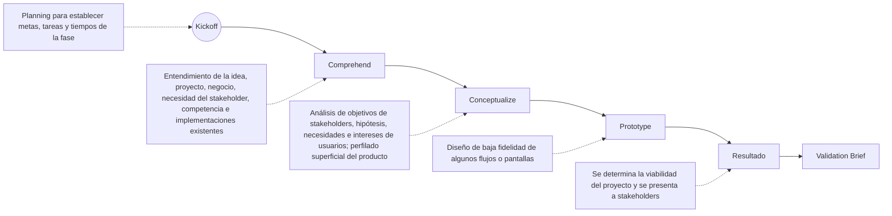

### 3.2 Actividades por etapa

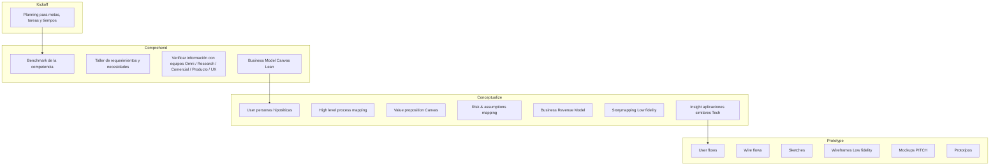

### 3.3 Entregables de Business Pre-validation

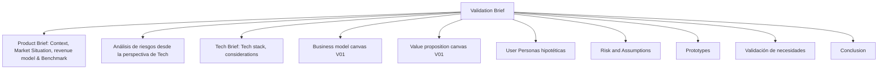

### 3.4 Intervención de arquitectura

| Etapa | Intervención de arquitectura | Preguntas clave |
|---|---|---|
| Kickoff | Alinear alcance técnico temprano, supuestos, restricciones y criterios de decisión. | ¿Qué problema real se quiere resolver? ¿Qué queda fuera? ¿Qué restricción técnica puede invalidar la idea? |
| Comprehend | Analizar ecosistema existente, dependencias, capacidades reutilizables, integraciones, riesgos de datos y canales. | ¿Ya existe algo que lo resuelva? ¿Qué sistemas toca? ¿Qué restricciones regulatorias, de datos o seguridad aparecen? |
| Conceptualize | Participar en el risk & assumptions mapping, revenue model y process mapping para detectar inviabilidad técnica o costo oculto. | ¿El modelo de negocio exige tiempo real? ¿Hay dependencias críticas? ¿Qué NFR cambian la solución? |
| Prototype | Validar que flujos de baja fidelidad sean técnicamente factibles y no omitan estados de error, permisos, trazabilidad o backoffice. | ¿Qué pasa con errores, reversas, conciliación, auditoría, permisos, soporte y operación? |
| Resultado | Emitir input técnico para go/no-go: riesgos, complejidad, approach recomendado y condiciones para implementar. | ¿Se puede construir de forma segura? ¿Qué debe validarse antes de comprometer roadmap? |
| Validation Brief | Consolidar Tech Brief, riesgos, assumptions y alternativas. | ¿Qué stack, integraciones y arquitectura inicial se recomiendan? ¿Qué deuda se acepta explícitamente? |

## 4. Product Implementation

### 4.1 Estructura del proceso

En esta fase se profundiza la idea validada y se prepara el producto para desarrollo. Legal, marketing y data aparecen como una banda transversal durante el proceso.

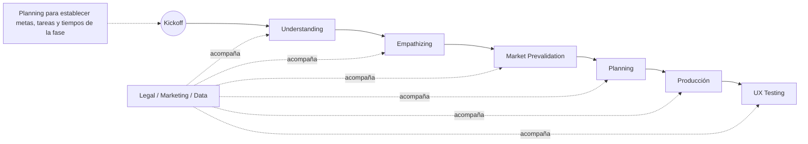

### 4.2 Definición de etapas

| Etapa | Descripción fiel al flujo |
|---|---|
| Understanding | Comprender alcances del proyecto, objetivos, contexto interno y externo en el mercado. El brief es clave. |
| Empathizing | Profundizar necesidades puntuales de usuarios para abordarlas en el futuro diseño. |
| Market Prevalidation | Prevalidación del mercado con los features a implementar. |
| Planning | Con los alcances definidos, perfilar producto, arquitectura, navegación, estilo y necesidades gráficas. |
| Producción | Actividades para plasmar el producto en pantallas de alta fidelidad y entregar a desarrollo. |
| UX Testing | Actividades para asegurar experiencia y usabilidad mediante pruebas a usuarios. |

### 4.3 Actividades por etapa

```mermaid
flowchart TB
  subgraph Understanding
    U1["Benchmark"]
    U2["Análisis de lo existente"]
    U3["Heurísticas"]
    U4["Lectura del brief"]
    U5["Análisis de data"]
    U6["Análisis factibilidad para el prototipo POC"]
    U7["Apoyar a que las reglas de negocio se cumplan"]
    U8["Feedback en diseño de componentes de software"]
    U9["Presupuesto para cada fase"]
  end

  subgraph Empathizing
    E1["User personas"]
    E2["Customer Journey"]
    E3["Blueprints"]
    E4["Taller de requerimientos y necesidades"]
    E5["Matriz de priorización"]
    E6["Focus group"]
  end

  subgraph MarketPrevalidation["Market Prevalidation"]
    M1["Entrevistas"]
    M2["Encuestas"]
    M3["Market Situation de acuerdo a las necesidades"]
  end

  subgraph Planning
    P1["Inventario de contenido"]
    P2["Arquitectura High Fidelity"]
    P3["Sitemap High Fidelity"]
    P4["Definición de lenguaje gráfico"]
    P5["Mapear dependencias existentes: proveedores y lógica del producto"]
    P6["Definición de alcances"]
    P7["Deadlines"]
    P8["Valoración expertos: reutilización de componentes"]
    P9["Validar que equipo de desarrollo sea adecuado para completar producto"]
    P10["Storymapping"]
    P11["Roadmap"]
    P12["Value proposition canvas 2.0"]
  end

  subgraph Produccion["Producción"]
    R1["Flujos de pantallas"]
    R2["Wireframes High fidelity - Mockups"]
    R3["Prototipos"]
    R4["Revisiones con equipo Developers"]
    R5["Sketches"]
    R6["Componentes de design system"]
    R7["User testing de acuerdo a la funcionalidad"]
    R8["User Stories"]
    R9["Anotaciones técnicas"]
  end

  subgraph UXTesting["UX Testing"]
    X1["Card sorting"]
    X2["Tree testing"]
    X3["Paper & click prototipo"]
    X4["Naming"]
    X5["Usabilidad"]
    X6["UXT"]
    X7["Paper & click prototipo"]
    X8["A-B Testing"]
    X9["Eye tracking"]
    X10["Pruebas heurísticas"]
  end

  Understanding --> Empathizing --> MarketPrevalidation --> Planning --> Produccion --> UXTesting
```

### 4.4 Intervención de arquitectura

| Etapa | Intervención de arquitectura | Departamentos involucrados |
|---|---|---|
| Understanding | Revisar brief, sistemas existentes, restricciones, datos disponibles, integraciones y factibilidad POC. | Producto, Tech, UX, Data, Comercial, Operaciones. |
| Empathizing | Traducir journeys y blueprints a capacidades, eventos, estados, permisos y puntos de dolor técnicos. | Producto, UX, Research, Tech. |
| Market Prevalidation | Evaluar si los features prometidos requieren capacidades nuevas, integraciones, data pipelines o cambios de plataforma. | Producto, Marketing, Data, Tech. |
| Planning | Definir arquitectura high-level, dependencias, reusable components, sizing de equipo, riesgos, roadmap técnico y deadlines realistas. | Producto, UX, Tech Leads, Data, Legal, Seguridad. |
| Producción | Revisar flujos y pantallas con developers para detectar casos borde, estados de error, contratos API, eventos, permisos y trazabilidad. | UX, Developers, Tech Leads, Design System. |
| UX Testing | Incorporar hallazgos de usabilidad que impacten arquitectura: performance frontend, analytics, experimentación, accesibilidad, tracking. | UX, Data, Producto, Tech. |
| Legal / Marketing / Data | Asegurar compliance, uso correcto de datos, consentimientos, tracking, taxonomía de eventos y claims de comunicación. | Legal, Marketing, Data, Producto, Tech. |

## 5. Desarrollo de software

### 5.1 Entrada y objetivo

La fase inicia con kickoff entre leads de Producto, UX y Tech. El equipo técnico debe hacer signoff de que tiene los suministros necesarios para desarrollar epics/user stories: flujos, wireframes y otros insumos. Antes de comenzar los sprints, se revisa planning para asegurar claridad de requerimientos y correcta ejecución del framework. BI y Data deben incluirse desde el inicio cuando corresponda.

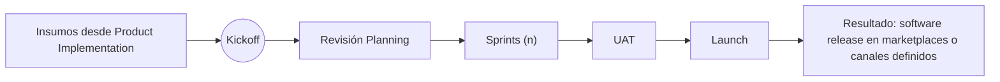

### 5.2 Insumos para desarrollo

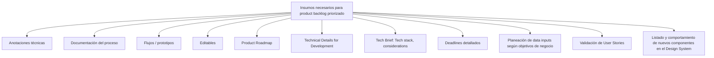

### 5.3 Etapas internas de desarrollo

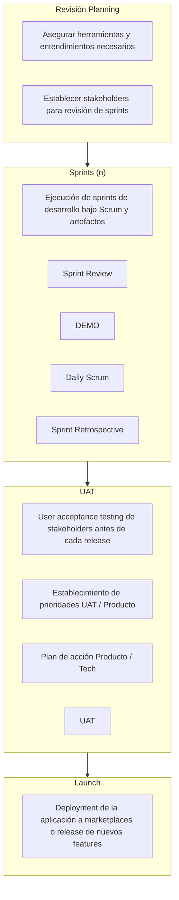

### 5.4 Scrum representado en la captura

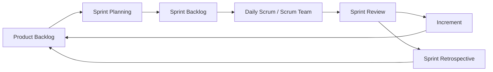

### 5.5 Intervención de arquitectura

| Etapa | Intervención de arquitectura | Decisión esperada |
|---|---|---|
| Kickoff | Confirmar que Tech entiende alcance, restricciones, integraciones, NFR, datos, riesgos y dependencias. | Signoff técnico o lista de bloqueantes. |
| Revisión Planning | Validar historias, criterios de aceptación, contratos API/eventos, dependencias y estrategia de delivery. | Backlog listo para sprint o refinamiento requerido. |
| Sprints | Acompañar decisiones de diseño emergentes, revisar PRs críticos, mantener guardrails y resolver trade-offs. | ADRs livianos, contratos estables, deuda explícita. |
| Sprint Review / Demo | Verificar que el incremento cumple funcionalidad, NFR y trazabilidad esperada. | Aceptar, ajustar o bloquear avance. |
| UAT | Priorizar bugs/ajustes con Producto, Tech y stakeholders; validar impacto de cambios tardíos. | Go/no-go por release, plan de acción. |
| Launch | Validar readiness: observabilidad, rollback, feature flags, runbook, soporte, métricas y comunicación. | Release aprobado o diferido. |
| BI/Data | Asegurar eventos, data inputs, tracking, calidad de datos y modelos de reporte desde el inicio. | Taxonomía de eventos y contratos de datos. |

## 6. Post Launch

### 6.1 Estructura

La captura indica que QA debe revisar producción, hacer smoke para encontrar bugs y ejecutar hotfix si corresponde. En conjunto con PO se decide si el hotfix se prioriza o espera al próximo lanzamiento.

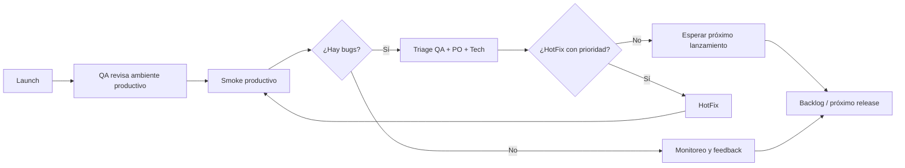

### 6.2 Intervención de arquitectura

| Momento | Intervención de arquitectura | Objetivo |
|---|---|---|
| Smoke productivo | Confirmar señales mínimas: health, logs, métricas, traces, errores, latencia y flujos críticos. | Detectar fallas reales rápido. |
| Triage | Diferenciar bug funcional, bug de integración, bug de datos, problema de infraestructura o degradación externa. | Evitar hotfix equivocado. |
| Decisión HotFix vs próximo release | Evaluar severidad, blast radius, workaround, riesgo de rollback y costo de esperar. | Priorizar con PO y QA. |
| HotFix | Revisar cambio mínimo, test de regresión, plan de rollback y monitoreo posterior. | Reducir riesgo operativo. |
| Próximo lanzamiento | Convertir hallazgos en backlog, deuda técnica, guardrail o mejora de proceso. | Aprendizaje continuo. |

## 7. Mapa transversal de intervención de arquitectura

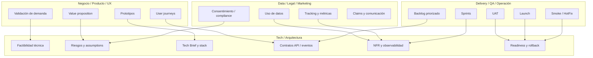

## 8. Etapas donde arquitectura debería intervenir

| Fase | Etapa | Tipo de intervención | Artefacto recomendado |
|---|---|---|---|
| Business Pre-validation | Kickoff | Encuadre técnico y riesgos iniciales. | Checklist de supuestos técnicos. |
| Business Pre-validation | Comprehend | Análisis de sistemas existentes, competencia e integraciones. | Mapa de contexto técnico. |
| Business Pre-validation | Conceptualize | Riesgos, assumptions, capacidades y procesos. | Risk & assumptions técnico. |
| Business Pre-validation | Prototype | Factibilidad de flujos, estados y errores. | Notas de arquitectura sobre prototipo. |
| Business Pre-validation | Validation Brief | Input formal para go/no-go. | Tech Brief inicial. |
| Product Implementation | Understanding | Revisión de brief, data, reglas y factibilidad POC. | Informe de factibilidad. |
| Product Implementation | Empathizing | Traducir journeys a capacidades y eventos. | Capability map. |
| Product Implementation | Market Prevalidation | Validar features contra capacidades reales. | Gap analysis técnico. |
| Product Implementation | Planning | Definir stack, dependencias, roadmap técnico y equipo. | Architecture brief / ADR inicial. |
| Product Implementation | Producción | Revisar flujos, pantallas, user stories y anotaciones técnicas. | Contratos API/eventos + criterios NFR. |
| Product Implementation | UX Testing | Evaluar impacto de hallazgos en performance, analytics y experiencia. | Backlog técnico priorizado. |
| Desarrollo | Kickoff | Signoff de insumos para desarrollo. | Definition of Ready técnica. |
| Desarrollo | Revisión Planning | Validar historias, dependencias y contratos. | Sprint architecture checklist. |
| Desarrollo | Sprints | Acompañar decisiones, PRs críticos y deuda. | ADRs livianos / tech notes. |
| Desarrollo | UAT | Evaluar severidad, go/no-go y plan de acción. | Release risk assessment. |
| Desarrollo | Launch | Readiness operativo, observabilidad, rollback. | Release checklist / runbook. |
| Post Launch | Smoke | Validar flujos productivos y señales operativas. | Smoke report. |
| Post Launch | HotFix decision | Evaluar prioridad, riesgo y blast radius. | Hotfix decision record. |
| Post Launch | Próximo release | Retroalimentar backlog y guardrails. | Lessons learned / deuda explícita. |

## 9. Preguntas de arquitectura por departamento

### Producto

- ¿Qué hipótesis de negocio invalidan el producto?
- ¿Qué capacidades son must-have vs nice-to-have?
- ¿Qué parte debe estar en el MVP y qué puede ir a roadmap?
- ¿Qué decisiones requieren datos reales antes de construir?

### UX / Research

- ¿Qué estados de error y casos borde faltan en los flujos?
- ¿Qué tareas del usuario exigen baja latencia?
- ¿Qué eventos de comportamiento deben medirse?
- ¿Qué componentes se reutilizan del design system?

### Tech / Desarrollo

- ¿Qué sistemas se integran y quién es owner?
- ¿Qué contratos API/eventos son necesarios?
- ¿Qué NFR aplican: latencia, disponibilidad, seguridad, auditabilidad?
- ¿Qué deuda se acepta para el MVP?

### Data / BI

- ¿Qué datos necesita negocio para medir éxito?
- ¿Qué eventos deben emitirse desde el primer release?
- ¿Qué calidad, ownership y retención tienen esos datos?
- ¿Qué dashboards o métricas son parte del lanzamiento?

### Legal / Compliance

- ¿Qué datos personales o sensibles se procesan?
- ¿Qué consentimientos o términos impactan la solución?
- ¿Qué auditoría se requiere?
- ¿Qué restricciones limitan tracking, campañas o segmentación?

### Marketing / Comercial

- ¿Los claims prometidos son compatibles con la capacidad real del producto?
- ¿La propuesta de valor exige SLAs o features que todavía no existen?
- ¿Qué mediciones de campaña o funnel se necesitan?

### QA / Operación

- ¿Cuáles son los smoke tests mínimos post-launch?
- ¿Qué alertas definen degradación?
- ¿Cuál es el rollback plan?
- ¿Cuándo un bug amerita HotFix?

## 10. Cómo contarlo en una discusión técnica

Una forma clara de explicarlo:

> “Arquitectura no entra sólo cuando hay que elegir framework o dibujar componentes. Interviene desde la validación de negocio para detectar inviabilidad, riesgos y dependencias; durante producto para convertir journeys en capacidades y contratos; durante desarrollo para sostener boundaries y NFR; y en post-launch para operar, medir y decidir hotfixes con evidencia.”

Y una versión más corta:

> “La arquitectura acompaña el ciclo completo: prevalidación, implementación de producto, desarrollo, lanzamiento y aprendizaje post-launch.”

## 11. Links relacionados

- [`docs/45-requisitos-y-estilos-arquitectonicos.md`](45-requisitos-y-estilos-arquitectonicos.md)
- [`docs/46-decisiones-de-stack-plataforma-e-iac.md`](46-decisiones-de-stack-plataforma-e-iac.md)
- [`docs/44-guion-presentacion-tecnica.md`](44-guion-presentacion-tecnica.md)
- [`docs/42-documentacion-metodica.md`](42-documentacion-metodica.md)
- [`docs/48-rfp-prd-adr-y-documentos-de-decision.md`](48-rfp-prd-adr-y-documentos-de-decision.md)
- [`vault/05-Methodology/Technical-Leadership-Mindset.md`](../vault/05-Methodology/Technical-Leadership-Mindset.md)
