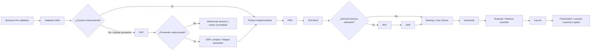

# 48 — RFP, PRD, ADR y documentos de decisión

Esta página ordena los documentos que aparecen alrededor de producto, arquitectura, compras, desarrollo y operación. El objetivo es evitar que un documento intente resolver todo: cada artefacto tiene una audiencia, un momento y una decisión distinta.

## 1. Idea principal

RFP, PRD y ADR no compiten entre sí.

- **RFP** responde: “¿a qué proveedor le pedimos una solución y bajo qué criterios?”
- **PRD** responde: “¿qué producto o funcionalidad queremos construir y por qué?”
- **ADR** responde: “¿qué decisión técnica tomamos, qué alternativas evaluamos y qué consecuencias aceptamos?”

Un buen proceso conecta estos documentos sin mezclarlos.

## 2. Matriz de documentos

| Documento | Propósito | Audiencia principal | Momento del proceso | Decisión que habilita |
|---|---|---|---|---|
| Validation Brief | Resumir viabilidad, valor, riesgos, usuarios y alcances tras prevalidación. | Producto, Tech, UX, stakeholders. | Fin de Business Pre-validation. | Go/no-go hacia implementación. |
| Tech Brief | Traducir la idea o PRD a restricciones técnicas, stack, riesgos y dependencias. | Tech, Arquitectura, Producto, Seguridad, Data. | Prevalidación y Planning. | Approach técnico inicial. |
| PRD | Definir qué construir, para quién, por qué, alcance, métricas y roadmap. | Producto, UX, Tech, QA, Data. | Product Implementation. | Qué entra al backlog de producto. |
| RFC | Abrir discusión técnica sobre una decisión relevante antes de cerrarla. | Tech Leads, Arquitectura, Seguridad, Data, Plataforma. | Discovery técnico o antes del sprint. | Feedback y consenso técnico. |
| ADR | Registrar una decisión técnica aceptada con contexto, alternativas y consecuencias. | Arquitectura, desarrollo, operación, futuros equipos. | Cuando se decide algo relevante. | Memoria técnica y trade-offs aceptados. |
| RFP | Solicitar propuestas a proveedores externos para resolver una necesidad. | Compras, Legal, Negocio, Tech, proveedores. | Cuando se evalúa comprar/tercerizar. | Selección o descarte de proveedor. |
| Runbook | Explicar cómo operar, monitorear, recuperar o escalar un sistema. | Operación, SRE, soporte, desarrollo. | Antes de launch y durante operación. | Operabilidad y respuesta a incidentes. |
| Postmortem / Lessons Learned | Documentar qué pasó, impacto, causa raíz y acciones posteriores. | Tech, operación, producto, liderazgo. | Después de incidentes o releases relevantes. | Mejoras y prevención futura. |

## 3. RFP

Una **RFP** es una solicitud formal de propuesta. Se usa cuando la organización necesita evaluar proveedores externos.

### Cuándo usar una RFP

- No existe capacidad interna suficiente.
- El time-to-market exige apoyo externo.
- Se necesita comparar proveedores con criterios homogéneos.
- Hay una compra relevante que requiere trazabilidad.
- Legal, compliance o compras necesitan formalizar el proceso.
- Se evalúa build vs buy.

### Qué debería incluir

- contexto y problema a resolver;
- objetivos de negocio;
- alcance esperado;
- restricciones técnicas y regulatorias;
- integración con sistemas existentes;
- criterios de evaluación;
- SLA/SLO esperados;
- seguridad, privacidad y compliance;
- presupuesto o rango estimado si aplica;
- timeline;
- formato de respuesta esperado.

### Relación con arquitectura

Arquitectura interviene para definir criterios técnicos y riesgos:

- lock-in;
- APIs e integraciones;
- residencia y propiedad de datos;
- observabilidad;
- seguridad;
- continuidad operativa;
- migración de salida;
- costo total de propiedad.

Una RFP puede derivar en un ADR si se decide comprar o integrar un proveedor.

## 4. PRD

Un **PRD** es el documento de requisitos de producto. Describe qué se va a construir y por qué.

### Cuándo usar un PRD

- Se construye una funcionalidad nueva.
- Se modifica un producto existente.
- Hay múltiples áreas involucradas.
- Se necesita alinear alcance, usuarios, métricas y roadmap.
- El backlog necesita contexto antes de escribirse como historias.

### Qué debería incluir

- problema u oportunidad;
- objetivos de negocio;
- usuarios/personas;
- alcance funcional;
- fuera de alcance;
- journeys o flujos principales;
- métricas de éxito;
- dependencias;
- riesgos;
- supuestos;
- roadmap o fases;
- criterios de aceptación de alto nivel.

### Relación con arquitectura

El PRD no debería resolver todos los detalles técnicos, pero sí debe dar señales para que arquitectura evalúe:

- requisitos no funcionales;
- integraciones;
- datos necesarios;
- permisos;
- auditoría;
- disponibilidad;
- latencia;
- escalabilidad;
- riesgos de operación.

El PRD alimenta Tech Brief, RFCs, ADRs y user stories.

## 5. RFC

Un **RFC** es un documento de discusión. Sirve para abrir una decisión técnica a feedback antes de aceptarla.

### Cuándo usar RFC

- La decisión impacta a más de un equipo.
- Hay varias alternativas razonables.
- Cambia contratos, datos o infraestructura.
- Puede generar lock-in.
- Impacta seguridad, costos, disponibilidad o latencia.
- Requiere consenso antes de implementarse.

### Qué debería incluir

- contexto;
- problema;
- opciones consideradas;
- propuesta recomendada;
- trade-offs;
- impacto en migración;
- impacto en operación;
- preguntas abiertas;
- deadline para feedback.

### Diferencia con ADR

El RFC es discusión; el ADR es decisión.

```text
RFC → debate y feedback
ADR → decisión aceptada y memoria histórica
```

## 6. ADR

Un **ADR** registra una decisión arquitectónica o técnica significativa.

### Cuándo escribir un ADR

- Se elige un stack o framework.
- Se adopta un patrón arquitectónico.
- Se compra o integra un proveedor relevante.
- Se define una estrategia de datos.
- Se acepta una deuda técnica importante.
- Se cambia una decisión anterior.
- Se define una política de plataforma o seguridad.

### Qué debería incluir

- título;
- estado: proposed, accepted, deprecated, superseded;
- contexto;
- decisión;
- alternativas consideradas;
- consecuencias positivas;
- consecuencias negativas;
- riesgos;
- criterios de reversibilidad;
- links a PRD, RFC, RFP, runbooks o issues.

### Qué no debería ser

- No es un documento de producto.
- No es una especificación completa.
- No es un runbook.
- No es una minuta de reunión.
- No es un lugar para justificar decisiones triviales.

## 7. Tech Brief

El **Tech Brief** conecta producto con arquitectura. Toma el problema de negocio y lo traduce a implicancias técnicas iniciales.

### Cuándo usarlo

- Durante Business Pre-validation.
- Durante Product Implementation.
- Antes de comprometer roadmap o equipo.
- Antes de un PRD complejo.
- Como input para RFCs o ADRs.

### Qué debería incluir

- resumen técnico del problema;
- sistemas involucrados;
- dependencias;
- restricciones;
- NFR relevantes;
- riesgos;
- opciones de solución;
- recomendación inicial;
- preguntas abiertas.

## 8. Runbook

Un **Runbook** explica cómo operar un sistema.

### Cuándo usarlo

- Antes de launch.
- Cuando hay soporte o guardias.
- Cuando hay procesos manuales o semiautomáticos.
- Cuando el sistema tiene dependencias críticas.
- Cuando existe riesgo de incidentes repetibles.

### Qué debería incluir

- health checks;
- dashboards;
- alertas;
- procedimientos de rollback;
- pasos de recuperación;
- contactos/owners;
- comandos seguros;
- criterios de escalamiento;
- escenarios conocidos.

## 9. Postmortem / Lessons Learned

Un **postmortem** o documento de lessons learned captura aprendizaje después de un incidente, release complejo o hallazgo importante.

### Qué debería incluir

- qué pasó;
- impacto;
- timeline;
- causa raíz;
- factores contribuyentes;
- qué funcionó;
- qué no funcionó;
- acciones correctivas;
- owners y fechas;
- links a ADRs o cambios de proceso.

## 10. Flujo recomendado



## 11. Cómo se conectan con el proceso de producto

| Fase del proceso | Documentos esperados | Intervención de arquitectura |
|---|---|---|
| Business Pre-validation | Validation Brief, Tech Brief inicial | Riesgos, factibilidad, assumptions, build vs buy. |
| Product Implementation | PRD, Tech Brief refinado | NFR, integraciones, datos, stack, dependencias. |
| Antes de desarrollo | RFC si hay debate; ADR si hay decisión | Trade-offs, consenso, memoria técnica. |
| Desarrollo | User Stories, ADRs, notas técnicas | Boundaries, contratos, deuda explícita. |
| Launch | Runbook, release checklist | Readiness, rollback, observabilidad. |
| Post Launch | Lessons Learned, postmortem, ADR updates | Aprendizaje, correcciones, cambio de decisiones. |

## 12. Antipatrones

### PRD que intenta ser arquitectura completa

Síntoma: el PRD prescribe framework, base de datos o infraestructura sin análisis técnico.

Riesgo: se confunde necesidad de producto con solución técnica.

Corrección: el PRD declara necesidades y restricciones; el Tech Brief/RFC/ADR decide solución.

### ADR que intenta ser PRD

Síntoma: el ADR explica usuarios, mercado, métricas de negocio y roadmap, pero no registra una decisión técnica concreta.

Riesgo: se pierde memoria arquitectónica.

Corrección: separar contexto de producto del registro de decisión técnica.

### RFP sin criterios técnicos

Síntoma: se evalúan proveedores sólo por precio o promesa comercial.

Riesgo: lock-in, integración débil, problemas de datos, seguridad u operación.

Corrección: arquitectura define criterios técnicos, NFR, salida/migración y riesgos.

### ADR sin alternativas

Síntoma: “elegimos X” sin explicar qué se descartó.

Riesgo: la decisión parece arbitraria y no sirve para futuros equipos.

Corrección: listar alternativas, trade-offs y consecuencias.

### Runbook escrito después del incidente

Síntoma: nadie sabe cómo operar o recuperar el sistema durante el primer problema real.

Riesgo: MTTR alto y decisiones improvisadas.

Corrección: runbook mínimo antes de launch.

## 13. Templates mínimos

### PRD mínimo

```markdown
# PRD — [Nombre]

## Problema
## Objetivos de negocio
## Usuarios / personas
## Alcance
## Fuera de alcance
## Flujos principales
## Requisitos funcionales
## Requisitos no funcionales esperados
## Métricas de éxito
## Dependencias
## Riesgos y supuestos
## Roadmap / fases
```

### ADR mínimo

```markdown
# ADR-XXXX — [Decisión]

## Estado
Accepted

## Contexto

## Decisión

## Alternativas consideradas

## Consecuencias positivas

## Consecuencias negativas

## Riesgos / mitigaciones

## Links relacionados
```

### RFP mínima

```markdown
# RFP — [Necesidad / Proyecto]

## Contexto
## Problema a resolver
## Alcance esperado
## Requisitos funcionales
## Requisitos no funcionales
## Integraciones esperadas
## Seguridad / compliance
## Criterios de evaluación
## Timeline
## Formato de respuesta del proveedor
## Presupuesto / restricciones comerciales si aplica
```

### Tech Brief mínimo

```markdown
# Tech Brief — [Producto / Feature]

## Resumen técnico
## Sistemas involucrados
## Datos requeridos
## Integraciones
## NFR relevantes
## Riesgos técnicos
## Opciones de solución
## Recomendación inicial
## Preguntas abiertas
```

## 14. Cómo contarlo en una discusión técnica

Frase larga:

> “Uso PRD para alinear intención de producto, RFP cuando hay que evaluar compra o proveedor externo, RFC para abrir discusión técnica y ADR para preservar la decisión tomada. El Tech Brief conecta producto con arquitectura, y el Runbook asegura que lo construido pueda operarse.”

Frase corta:

> “PRD define qué y por qué; ADR registra cómo decidimos resolverlo; RFP ordena comprar versus construir.”

## 15. Relación con este repo

En este repo:

- `docs/45-requisitos-y-estilos-arquitectonicos.md` funciona como PRD/brief de requisitos transversal.
- `docs/46-decisiones-de-stack-plataforma-e-iac.md` funciona como guía de criterios para Tech Brief/RFC/ADR.
- `docs/47-intervencion-arquitectura-en-procesos.md` ubica en qué etapa aparece cada documento.
- `vault/02-Decisions/` contiene ADRs reales.
- `docs/34-lessons-learned.md` funciona como lessons learned.
- `docs/35-runbook-demo-fails.md` funciona como runbook de demo/fallas.

## 16. Links relacionados

- [`docs/42-documentacion-metodica.md`](42-documentacion-metodica.md)
- [`docs/45-requisitos-y-estilos-arquitectonicos.md`](45-requisitos-y-estilos-arquitectonicos.md)
- [`docs/46-decisiones-de-stack-plataforma-e-iac.md`](46-decisiones-de-stack-plataforma-e-iac.md)
- [`docs/47-intervencion-arquitectura-en-procesos.md`](47-intervencion-arquitectura-en-procesos.md)
- [`vault/02-Decisions/`](../vault/02-Decisions/)
