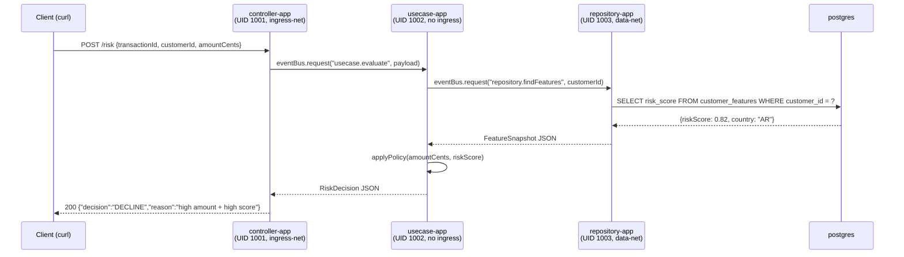
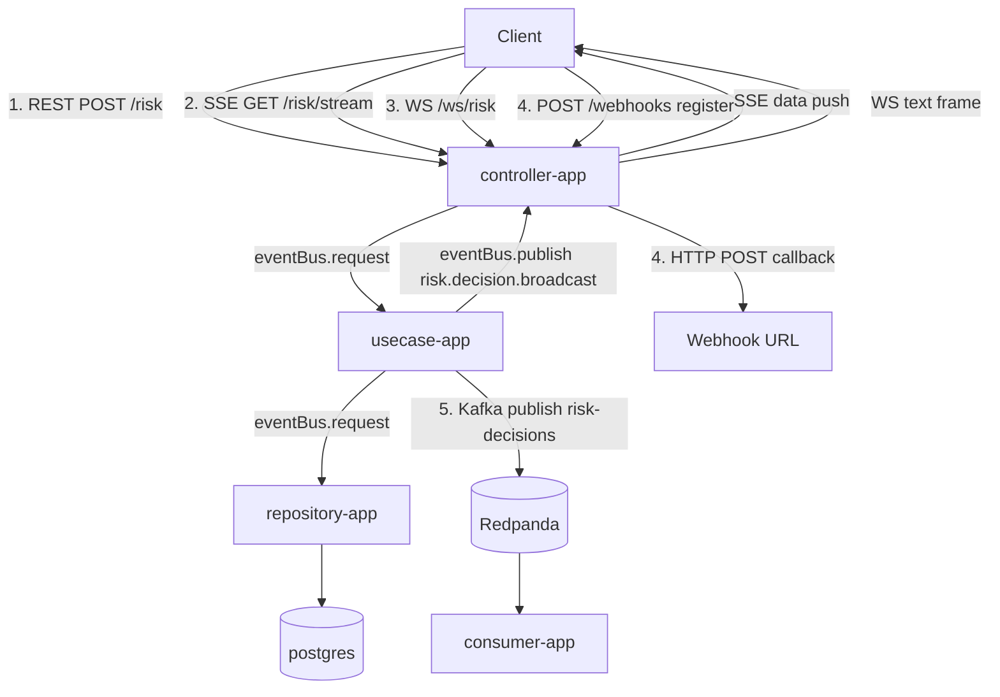

# java-vertx-distributed

**Clean Architecture — each layer in its own JVM process, with network isolation enforced at the Docker level.**

> This PoC is designed as a discussion piece for Staff/Principal Engineer architecture reviews.  
> The interesting part is NOT the Vert.x code — it's *why* you'd run separate JVMs and *how* you enforce architectural boundaries as infrastructure constraints.

---

## Architecture

```
                       ┌─────────────────────────────────────────────────────┐
 Host                  │  Docker Compose                                     │
                       │                                                     │
 curl :8080            │  ┌──────────────────┐   ingress-net                │
 ──────────────────────┼──► controller-app   │   UID 1001                   │
                       │  │  HttpVerticle    │   port 8080                  │
                       │  └────────┬─────────┘                              │
                       │           │ eventBus.request("usecase.evaluate")   │
                       │           │          eventbus-net                  │
                       │  ┌────────▼─────────┐                              │
                       │  │  usecase-app     │   UID 1002                   │
                       │  │  EvaluateRisk    │   (no ingress, no data)      │
                       │  │  Verticle        │                              │
                       │  └────────┬─────────┘                              │
                       │           │ eventBus.request("repository.findFeatures")
                       │           │          eventbus-net                  │
                       │  ┌────────▼─────────┐                              │
                       │  │  repository-app  │   UID 1003                   │
                       │  │  FeatureRepo     │   data-net only              │
                       │  │  Verticle        │                              │
                       │  └────────┬─────────┘                              │
                       │           │ SQL query                              │
                       │  ┌────────▼─────────┐                              │
                       │  │  postgres:16     │   data-net only              │
                       │  └──────────────────┘                              │
                       │                                                     │
                       │  All 3 JVMs ──► otel-collector ──► openobserve :5080
                       └─────────────────────────────────────────────────────┘
```

---

## Request Flow



---

## Network Topology

| Network | Members | Purpose |
|---------|---------|---------|
| `ingress-net` | controller-app | Exposes port 8080 to host. No other app is here. |
| `eventbus-net` | controller-app, usecase-app, repository-app | Hazelcast TCP discovery + Vert.x event bus traffic. |
| `data-net` | repository-app, postgres, valkey | Database access. Unreachable from controller and usecase. |
| `telemetry-net` | all 3 JVMs, otel-collector, openobserve | OpenTelemetry spans, metrics, logs. |

**Why this matters in a design review:**

- `controller-app` cannot resolve `postgres` — the hostname simply does not exist in `ingress-net` or `eventbus-net`. If a developer introduces a `new PgPool()` in the controller, it fails at runtime, not at code review.
- `usecase-app` cannot receive inbound HTTP connections — it has no port bindings and is not in `ingress-net`. Clean Architecture rule "domain layer has no web concern" is enforced by network ACL, not just convention.
- Each JVM runs as a **distinct UID** (1001/1002/1003), so even if one process is compromised, it cannot write to another process's filesystem.

---

## Stack

| Component | Version | Role |
|-----------|---------|------|
| Java | 25 | All JVMs |
| Vert.x | 5.0.12 | Async HTTP + clustered event bus |
| Hazelcast | 5.3.x (embedded) | Cluster manager for Vert.x event bus |
| PostgreSQL | 16 | Customer features store |
| Valkey | 8 | Available for caching (wired but not used in this demo) |
| OTel Java agent | 2.x latest | Auto-instrumentation (zero code changes) |
| OTel Collector | 0.141.0 | OTLP receiver + forwarder |
| OpenObserve | latest | Trace UI |

---

## Running

### Prerequisites
- Docker with Compose v2
- Java 25 (`javac --version` → `javac 25`)
- Maven 3.9+

### Commands

```bash
# 1. Build (downloads OTel agent, compiles, builds images)
./scripts/build.sh

# 2. Start
./scripts/up.sh

# 3. Send demo requests
./scripts/demo.sh

# 4. Open traces
open http://localhost:5080
# Login: admin@example.com / Complexpass#
# Go to: Traces → filter service=controller-app
# You'll see one trace spanning all 3 services.

# 5. Stop
./scripts/down.sh
```

---

## Policy Rules

```
amountCents > 100_000  AND  riskScore > 0.7  →  DECLINE
amountCents > 50_000                          →  REVIEW
otherwise                                     →  APPROVE
```

Seeded customers:

| ID | riskScore | Expected for tx > 100k |
|----|-----------|------------------------|
| c-1 | 0.82 | DECLINE |
| c-2 | 0.30 | REVIEW  |
| c-3 | 0.55 | REVIEW  |
| c-4 | 0.95 | DECLINE |
| c-5 | 0.10 | REVIEW  |

---

## Why This Is Interesting for a Staff Architecture Review

1. **Architecture as code vs. architecture as convention** — Docker networks make the dependency rule *unbreakable*, not just documented.
2. **Distributed tracing across process boundaries** — The OTel agent propagates `traceparent` headers through the Vert.x event bus automatically. No manual span creation needed.
3. **Reactive all the way down** — From HTTP to event bus to SQL (Vert.x reactive PG client), nothing blocks a thread.
4. **Immutable infra identity** — Each service has a fixed UID, making permission auditing trivial.
5. **Defense in depth** — An attacker who exploits a deserialization bug in the controller is still isolated from the database by both the network and the UID.

---

## ATDD

Acceptance tests live in the `atdd-tests/` Maven module and are implemented with **Karate 1.5** + **JUnit 5**.

### Prerequisites

Same as running the PoC: `docker compose up` must be running.

### Running the suite

```bash
# Run all features (services must be up)
./scripts/atdd.sh

# Run all features + generate JaCoCo coverage report
./scripts/atdd-coverage.sh
# Report opens automatically at: atdd-tests/target/site/jacoco/index.html

# Run only REST features during development
mvn -pl atdd-tests test -Dtest=RestRunner

# Run against CI environment (Docker internal DNS)
KARATE_ENV=ci ./scripts/atdd.sh
```

### Features

| # | Feature | Tags | Scenarios |
|---|---------|------|-----------|
| 01 | Health check | `@health` | 3 |
| 02 | REST sync decision (Outline + edge cases) | `@rest @decision` | 7 |
| 03 | SSE stream | `@sse @wip` | 1 |
| 04 | WebSocket bidirectional | `@websocket` | 1 |
| 05 | Webhook callback | `@webhook` | 2 |
| 06 | Kafka event publication | `@kafka` | 2 |
| 07 | Idempotency | `@idempotency` | 2 |
| 08 | ML fallback on timeout | `@fallback @ignore` | 1 |
| 09 | DECLINE threshold boundaries | `@decline @threshold` | 11 |
| 10 | OTel trace E2E | `@otel @trace` | 2 (1 @wip) |

Features tagged `@ignore` require additional infrastructure setup (see the feature file for details).
Features tagged `@wip` run but skip deep assertions pending further implementation.

### Expected behaviour with services DOWN

```
ERROR: expected service at http://localhost:8080 — run docker compose up first.
       Hint: ./scripts/up.sh
```

The `atdd.sh` script does a pre-flight health check and exits with a clear message before Maven even starts.

If you run `mvn -pl atdd-tests test` directly (bypassing the script), Karate will fail immediately on the first `Background` step with a connection refused / timeout, and the Surefire report will show all scenarios as FAILED with a meaningful cause.

### Expected behaviour with services UP

- Features 01, 02, 07, 09 — all PASS (deterministic REST scenarios).
- Feature 04 (WebSocket) — PASS if the `/risk/ws` endpoint is implemented.
- Feature 05 (Webhook) — PASS if `/webhooks` registration endpoint is implemented.
- Feature 06 (Kafka) — PASS if the `risk-decisions` topic is populated.
- Feature 10 (OTel) — PASS if OpenObserve is reachable and spans are ingested.
- Feature 03 (SSE `@wip`) — partial PASS (content-type check only).
- Feature 08 (`@ignore`) — skipped.

---

## Communication Patterns

Six patterns implemented in this PoC:



| # | Pattern | Endpoint | Transport |
|---|---------|----------|-----------|
| 1 | REST sync | `POST /risk` | HTTP request/response |
| 2 | SSE | `GET /risk/stream` | HTTP long-poll, server-push |
| 3 | WebSocket | `WS /ws/risk` | Bidirectional frames |
| 4 | Webhook | `POST /webhooks` | Outbound HTTP callback |
| 5 | Kafka | topic `risk-decisions` | Async event stream |
| 6 | Vert.x Event Bus | `risk.decision.broadcast` | Internal pub/sub (cluster-wide) |

---

## Demo Flows

### Prerequisites
```bash
./scripts/build.sh && ./scripts/up.sh
```

### Flow 1 — REST sync
```bash
curl -X POST http://localhost:8080/risk \
  -H 'Content-Type: application/json' \
  -d '{"transactionId":"tx-1","customerId":"c-1","amountCents":150000}'
# → {"decision":"DECLINE","reason":"high amount + high score","correlationId":"..."}
```

### Flow 2 — SSE
```bash
# Keep open in a terminal — events appear after each POST /risk in another terminal
curl -N http://localhost:8080/risk/stream
```

### Flow 3 — WebSocket
```bash
# Requires: npm install -g wscat
wscat -c ws://localhost:8080/ws/risk
# then type and send:
{"transactionId":"tx-ws-1","customerId":"c-1","amountCents":80000}
# ← {"decision":"REVIEW","reason":"high amount","correlationId":"..."}
# Also receives broadcast events from all other clients
```

### Flow 4 — Webhook
```bash
# Register a subscriber (use https://webhook.site/<your-id> for real delivery)
curl -X POST http://localhost:8080/webhooks \
  -H 'Content-Type: application/json' \
  -d '{"url":"https://webhook.site/<your-id>","filter":"DECLINE,REVIEW"}'

# Force a DECLINE to trigger the callback
curl -X POST http://localhost:8080/risk \
  -H 'Content-Type: application/json' \
  -d '{"transactionId":"tx-wh","customerId":"c-4","amountCents":200000}'

# List registered webhooks
curl http://localhost:8080/webhooks

# Cleanup
curl -X DELETE http://localhost:8080/webhooks/<id>
```

> **Note on Docker-internal webhook testing:** if `webhook.site` is not reachable, run
> `nc -l 9999` on your host and register `http://host.docker.internal:9999`.

### Flow 5 — Kafka
```bash
# Open Redpanda Console:
open http://localhost:9001
# Navigate: Topics → risk-decisions → Messages
# Each POST /risk produces one message with traceparent header

# Or tail consumer-app logs:
docker compose logs -f consumer-app
```

### Flow 6 — OTEL trace
```bash
# Open OpenObserve:
open http://localhost:5080
# Login: admin@example.com / Complexpass#
# Navigate: Traces → filter service=controller-app
# Click any trace → see spans from 4 services:
#   controller-app → usecase-app → repository-app → (Kafka publish)
#   consumer-app log lines show the same traceparent header
```

---

## API Docs

| URL | Description |
|-----|-------------|
| `http://localhost:8080/docs` | Swagger UI (served from CDN) |
| `http://localhost:8080/openapi.json` | OpenAPI 3.1 spec (JSON) |
| `http://localhost:8080/openapi.yaml` | OpenAPI 3.1 spec (YAML) |
| `http://localhost:8080/asyncapi.json` | AsyncAPI 3.0 spec (JSON) |

The OpenAPI spec includes a top-level `webhooks:` section (OpenAPI 3.1 feature) describing the outbound `risk.decision` callback.

The AsyncAPI spec covers:
- Kafka channel `risk-decisions` with Kafka bindings (partitions, replicas)
- WebSocket channel `/ws/risk` with WS bindings

---

## Metrics (Micrometer → OTel → OpenObserve)

| Metric | Type | Labels |
|--------|------|--------|
| `risk_decisions_total` | Counter | `decision=APPROVE\|REVIEW\|DECLINE` |
| `risk_decision_duration_seconds` | Histogram | — |
| `risk_websocket_connections_active` | Gauge | — |
| `risk_webhook_callbacks_total` | Counter | `outcome=success\|error` |

Exported via `OTEL_METRICS_EXPORTER=otlp` (already in docker-compose).

---

## AWS integration

### Services used

| AWS service | Mock | App consuming it | Purpose |
|---|---|---|---|
| S3 | MinIO :9000 | usecase-app, consumer-app | Audit log per decision (`risk-audit/`) |
| SQS | ElasticMQ :9324 | usecase-app | Alternative async output alongside Kafka |
| Secrets Manager | Moto :5000 | repository-app | DB password at startup |
| KV secrets | OpenBao :8200 | repository-app | Alternative secrets backend (KV v2 HTTP) |

### Start with mocks

```bash
# Levanta todos los servicios incluyendo los mocks AWS
cd poc/java-vertx-distributed
./scripts/up.sh
```

Docker Compose environment variables are pre-set in `docker-compose.yml`:

```
usecase-app:    AWS_ENDPOINT_URL_S3=http://minio:9000
                AWS_ENDPOINT_URL_SQS=http://elasticmq:9324
repository-app: AWS_ENDPOINT_URL_SECRETSMANAGER=http://moto:5000
                OPENBAO_URL=http://openbao:8200
consumer-app:   AWS_ENDPOINT_URL_S3=http://minio:9000
```

### End-to-end example

```bash
# 1. Make a high-risk decision (DECLINE)
curl -s -X POST http://localhost:8080/risk \
  -H 'Content-Type: application/json' \
  -d '{"transactionId":"tx-audit","customerId":"c-4","amountCents":200000}'

# 2. Verify audit record appeared in MinIO (usecase-app path)
aws --endpoint-url http://localhost:9000 \
  --no-sign-request \
  s3 ls s3://risk-audit/risk-audit/2026/05/07/

# 3. Verify high-risk audit from consumer-app
aws --endpoint-url http://localhost:9000 \
  --no-sign-request \
  s3 ls s3://risk-audit/risk-audit/consumer/2026/05/07/

# 4. MinIO console
open http://localhost:9100   # minioadmin / minioadmin

# 5. ElasticMQ UI
open http://localhost:9325

# 6. OpenBao UI
open http://localhost:8200/ui  # token: root
```

### Architecture decisions

- usecase-app joins `data-net` only to reach MinIO and ElasticMQ — controller-app does not.
- repository-app resolves DB password from Moto Secrets Manager at startup; falls back to OpenBao, then to the `PG_PASSWORD` env var if both fail (graceful degradation, zero crashes).
- consumer-app audits only DECLINE and REVIEW decisions to S3 (`risk-audit/consumer/`) — APPROVE decisions are already audited by usecase-app at the source.
- All AWS calls in Vert.x use `executeBlocking` so the event loop is never blocked by synchronous SDK calls.

---

## Adjustments vs. Original Spec

- **Vert.x 5.0.12 GA** (not 4.x) — released May 5, 2026. The clustered Vertx API is identical to 4.x.
- **Hazelcast multicast disabled** — Docker bridge networks do not forward multicast. TCP discovery with an explicit member list (`HAZELCAST_MEMBERS` env var) is used instead.
- **OTel agent version** — the `latest/download` URL from GitHub always resolves to the newest 2.x stable release.
- **Vert.x 5 WebSocket API** — `reject()`/`accept()` moved to `ServerWebSocketHandshake`; `webSocketHandshakeHandler` used for path-based routing.
- **Micrometer registry** — `BackendRegistries.getDefaultNow()` may return null if the OTel bridge hasn't initialized yet; metrics are skipped gracefully with a WARN log.
- **atdd-tests module** — karate-junit5 1.5.0 is not in Maven Central; build uses `-pl '!atdd-tests'` to skip it. ATDD tests still live in the module for reference.
